# 五、数据可视化

### 1. 基本绘图
- `mp.plot(水平坐标, 垂直坐标)`


```python
# plt1.py
import numpy as np
import matplotlib.pyplot as mp
x = np.linspace(-np.pi, np.pi, 1000) # arange可以生成类似的整数
print(x.shape)
cos_y = np.cos(x)
sin_y = np.sin(x)
mp.plot(x, cos_y)
mp.plot(x, sin_y)
mp.show()
```

    (1000,)


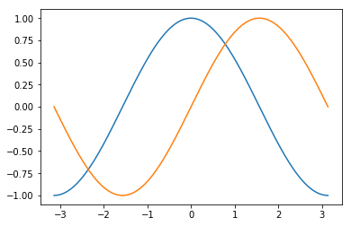


### 2. 线型、线宽和颜色
- `mp.plot(..., linestyle=线型, linewidth=线宽, color=颜色, ...)`


```python
# plt2.py
import numpy as np
import matplotlib.pyplot as mp
x = np.linspace(-np.pi, np.pi, 1000) # arange可以生成类似的整数
print(x.shape)
cos_y = np.cos(x)
sin_y = np.sin(x)
mp.plot(x, cos_y, linestyle='--', linewidth=1, color='red')
mp.plot(x, sin_y, linestyle=':', linewidth=3, color='green')
mp.show()
```

    (1000,)


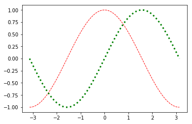


### 3. 设置坐标范围
- `mp.xlim(水平坐标最小值, 水平坐标最大值)`
- `mp.ylim(垂直坐标最小值, 垂直坐标最大值)`


```python
# plt3.py
import numpy as np
import matplotlib.pyplot as mp
x = np.linspace(-np.pi, np.pi, 1000) # arange可以生成类似的整数
mp.xlim(x.min() * 1.2, x.max() * 1.2)
mp.ylim(sin_y.min() * 1.2, sin_y.max() * 5)
cos_y = np.cos(x)
sin_y = np.sin(x)
mp.plot(x, cos_y)
mp.plot(x, sin_y)
mp.show()
```


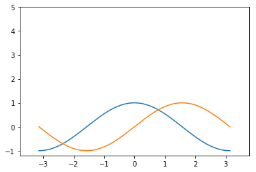


### 4. 设置坐标刻度
- `mp.xticks(位置序列[, 标签序列])`
- `mp.yticks(位置序列[, 标签序列])`


```python
# plt4.py
import numpy as np
import matplotlib.pyplot as mp
x = np.linspace(-np.pi, np.pi, 1000) # arange可以生成类似的整数
cos_y = np.cos(x)
sin_y = np.sin(x)

mp.yticks([-1, -0.5, 0, 0.5, 1])
mp.xticks([-np.pi, -np.pi / 2, 0, np.pi / 2, np.pi], 
          [r'$-\pi$', r'$-\frac{\pi}{2}$', r'$0$', r'$\frac{\pi}{2}$', r'$\pi$'])

mp.plot(x, cos_y)
mp.plot(x, sin_y)
mp.show()
```


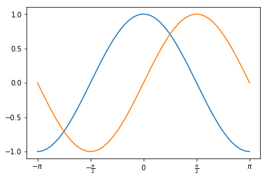


### 5. 设置坐标轴
- 坐标轴名：left/right/bottom/top
- `ax = mp.gca() # 获取当前坐标轴`
- `ax.spines['坐标轴名'].set_position((坐标系, 坐标))`
- `ax.spines['坐标轴名'].set_color(颜色)`


```python
# plt5.py
import numpy as np
import matplotlib.pyplot as mp
x = np.linspace(-np.pi, np.pi, 1000) # arange可以生成类似的整数
cos_y = np.cos(x)
sin_y = np.sin(x)
ax = mp.gca()
ax.spines['left'].set_position(('data', 0))
ax.spines['bottom'].set_position(('data', 0))
ax.spines['right'].set_color(None)
ax.spines['top'].set_color(None)
mp.plot(x, cos_y)
mp.plot(x, sin_y)
mp.show()
```


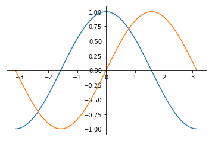


### 6. 图例
- `mp.plot(..., label=图例标签, ...)`
- `mp.legend([loc=位置])`


```python
# plt6.py
import numpy as np
import matplotlib.pyplot as mp
x = np.linspace(-np.pi, np.pi, 1000) # arange可以生成类似的整数
cos_y = np.cos(x)
sin_y = np.sin(x)
mp.plot(x, cos_y, label=r'$cos(x)$')
mp.plot(x, sin_y, label=r'$sin(x)$')
# mp.legend(loc='lower right')
mp.legend()
mp.show()
```


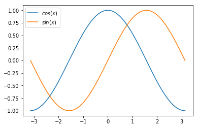


### 7. 特殊点
    mp.scatter(水平坐标, 垂直坐标, marker=点型, s=大小,
               color=颜色, edgecolor=边缘色, facecolor=填充色,
               zorder=图层序号)


```python
# plt7.py
import numpy as np
import matplotlib.pyplot as mp
x = np.linspace(-np.pi, np.pi, 1000) # arange可以生成类似的整数
cos_y = np.cos(x)
sin_y = np.sin(x)

xo = np.pi * 3 / 4
yo_cos = np.cos(xo)
yo_sin = np.sin(xo)

mp.plot(x, cos_y, label=r'$cos(x)$')
mp.plot(x, sin_y, label=r'$sin(x)$')
mp.legend()

# zorder表示图层上下
mp.scatter([xo, xo], [yo_cos, yo_sin], marker='*', s=100, edgecolor='red', facecolor='green', zorder=3) 
mp.plot([xo, xo], [yo_cos, yo_sin], linewidth=1, color='dodgerblue')
mp.show()
```


### 8. 备注
    mp.annotate(备注文本,
                xy=目标坐标,
                xycoords=目标坐标系,
                xytext=文本坐标,
                textcoords=文本坐标系,
                fontsize=字体大小,
                arrowprops=箭头线属性)


```python
# plt8.py
import numpy as np
import matplotlib.pyplot as mp
x = np.linspace(-np.pi, np.pi, 1000) # arange可以生成类似的整数
cos_y = np.cos(x)
sin_y = np.sin(x)
ax = mp.gca()
ax.spines['left'].set_position(('data', 0))
ax.spines['bottom'].set_position(('data', 0))
ax.spines['right'].set_color(None)
ax.spines['top'].set_color(None)

xo = np.pi * 3 / 4
yo_cos = np.cos(xo)
yo_sin = np.sin(xo)
mp.scatter([xo, xo], [yo_cos, yo_sin], marker='*', s=100, edgecolor='red', facecolor='green', zorder=3) 
mp.plot([xo, xo], [yo_cos, yo_sin], linewidth=1, color='dodgerblue')

mp.plot(x, cos_y, label=r'$cos(x)$')
mp.plot(x, sin_y, label=r'$sin(x)$')
mp.legend()

mp.annotate(r'$cos(\frac{3\pi}{4})=-\frac{\sqrt{2}}{4}$', xy=(xo, yo_cos), xycoords='data', xytext=(-90, -40), 
            textcoords='offset points', 
            fontsize=14, 
            arrowprops=dict(arrowstyle='->', connectionstyle='arc3, rad=.2'))
mp.annotate(r'$sin(\frac{3\pi}{4})=\frac{\sqrt{2}}{2}$', xy=(xo, yo_sin), xycoords='data', xytext=(20, 40), 
            textcoords='offset points', 
            fontsize=14, 
            arrowprops=dict(arrowstyle='->', connectionstyle='arc3, rad=.2'))

mp.show()
```


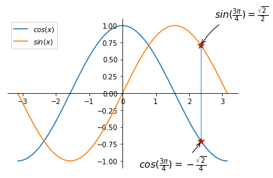


### 9. 图形对象(图形窗口)
- 如果"窗口名称"是第一次出现，那么就创建一个新窗口，其标题栏显示该名称，如果"窗口名称"已经出现过，那么不再创建新窗口，而只是将与该名称相对应的窗口设置为当前窗口。所谓当前窗口，就是接受后续绘图操作的窗口。
        mp.figure(窗口名称, figsize=窗口大小, dpi=分辨率, facecolor=颜色)
        mp.title(标题文本, fontsize=字体大小)
        mp.xlabel(水平轴标签, fontsize=字体大小)
        mp.ylabel(垂直轴标签, fontsize=字体大小)
        mp.tick_params(..., labelsize=刻度标签字体大小, ...)
        mp.grid(linestyle=网格线型)
        mp.tight_layout() # 紧凑布局


```python
# fig
import numpy as np
import matplotlib.pyplot as mp

x = np.linspace(-np.pi, np.pi, 1000)
cos_y = np.cos(x)
sin_y = np.sin(x)

mp.figure('Figure Object 1', figsize=(4, 3), dpi=120, facecolor='lightgray')
mp.title('Figure Object 1', fontsize=12)
mp.xlabel('x', fontsize=10)
mp.ylabel('y', fontsize=10)
mp.tight_layout()
mp.tick_params(labelsize=6)
mp.grid(linestyle=':')

mp.figure('Figure Object 2', figsize=(4, 3), dpi=120, facecolor='lightgray')
mp.title('Figure Object 2', fontsize=12)
mp.xlabel('x', fontsize=10)
mp.ylabel('y', fontsize=10)
mp.tight_layout()
mp.tick_params(labelsize=6)
mp.grid(linestyle=':')

mp.figure('Figure Object 1')
mp.plot(x, cos_y, c='dodgerblue', label=r'$y=cos(x)$')
mp.legend()

mp.figure('Figure Object 2')
mp.plot(x, sin_y, c='orange', label=r'$y=sin(x)$')
mp.legend()

mp.show()
```


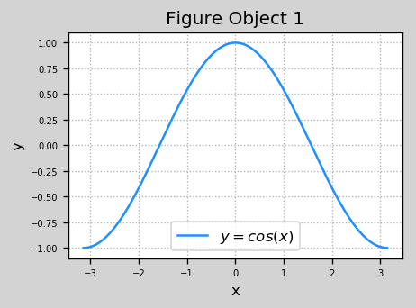


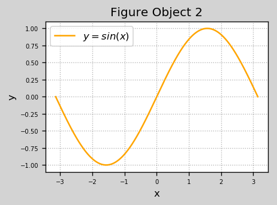


### 10. 子图

#### 矩阵式布局
    mp.subplot(行数, 列数, 序号)
    1 2 3
    4 5 6
    7 8 9
    mp.subplot(3, 3, 5)


```python
# sub1.py
import matplotlib.pyplot as mp
mp.figure('Subplot', facecolor='lightgray')

mp.subplot(221)
mp.xticks(())  # 不显示刻度
mp.yticks(())
mp.text(0.5, 0.5, '1', ha='center', va='center', size=36, alpha=0.5)

mp.subplot(222)
mp.xticks(())  # 不显示刻度
mp.yticks(())
mp.text(0.5, 0.5, '2', ha='center', va='center', size=36, alpha=0.5)

mp.subplot(223)
mp.xticks(())  # 不显示刻度
mp.yticks(())
mp.text(0.5, 0.5, '3', ha='center', va='center', size=36, alpha=0.5)

mp.subplot(224)
mp.xticks(())  # 不显示刻度
mp.yticks(())
mp.text(0.5, 0.5, '4', ha='center', va='center', size=36, alpha=0.5)

mp.tight_layout()
mp.show()
```


#### 网格式布局
    import matplotlib.gridspec as mg
    gs = mg.GridSpec(行数, 列数)
    mp.subplot(gs[占行, 占列])


```python
# sub2.py
import matplotlib.pyplot as mp
import matplotlib.gridspec as mg
mp.figure('Grid', facecolor='lightgray')
gs = mg.GridSpec(3, 3)

mp.subplot(gs[0, :2])
mp.xticks(())
mp.yticks(())
mp.text(0.5, 0.5, '1', ha='center', va='center', size=36, alpha=0.5)

mp.subplot(gs[1:, :1])
mp.xticks(())
mp.yticks(())
mp.text(0.5, 0.5, '2', ha='center', va='center', size=36, alpha=0.5)

mp.subplot(gs[2, 1:])
mp.xticks(())
mp.yticks(())
mp.text(0.5, 0.5, '3', ha='center', va='center', size=36, alpha=0.5)

mp.subplot(gs[:2, 2])
mp.xticks(())
mp.yticks(())
mp.text(0.5, 0.5, '4', ha='center', va='center', size=36, alpha=0.5)

mp.subplot(gs[1, 1])
mp.xticks(())
mp.yticks(())
mp.text(0.5, 0.5, '5', ha='center', va='center', size=36, alpha=0.5)
mp.tight_layout()
mp.show()
```


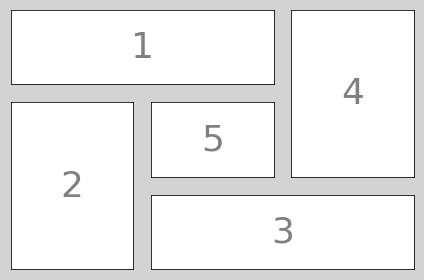


#### 自由式布局
    mp.axes([左, 底, 宽, 高])


```python
# sub3.py
import matplotlib.pyplot as mp
mp.figure('Axes', facecolor='lightgray')
mp.xticks(())
mp.yticks(())
mp.text(0.5, 0.5, '1', ha='center', va='center', size=56, alpha=0.5)

mp.axes([0.58, 0.15, 0.3, 0.3])
mp.xticks(())
mp.yticks(())
mp.text(0.5, 0.5, '2', ha='center', va='center', size=25, alpha=0.5)

mp.show()
```


### 11. 刻度定位器
    刻度定位器对象 = mp.xxxLocator(...)
    ax = mp.gca()
    ax.xaxis.set_major_locator(刻度定位器对象)
    ax.xaxis.set_minor_locator(刻度定位器对象)
    ax.yaxis.set_major_locator(刻度定位器对象)
    ax.yaxis.set_minor_locator(刻度定位器对象)


```python
# tick.py
import numpy as np
import matplotlib.pyplot as mp
mp.figure('Locator', dpi=150)

# 刻度定位器列表
locators = [# 空定位器：不绘制刻度
            'mp.NullLocator()',
            # 最大定位器：最多绘制nbins个刻度，每两个刻度之间间隔葱steps列表中选择
            'mp.MaxNLocator(nbins=3, steps=[1, 3, 5, 7, 9])',
            # 定点定位器：根据locs参数中的位置绘制刻度
            'mp.FixedLocator(locs=[0, 2.5, 5, 7.5, 10])',
            # 自动定位器：由系统自动选择刻度绘制位置
            'mp.AutoLocator()',
            # 索引定位器：由offset确定起始刻度，由base确定相邻间隔
            'mp.IndexLocator(offset=0.5, base=1.5)',
            # 多点定位器：从0开始，按照参数指定的间隔（缺省1）绘制刻度
            'mp.MultipleLocator()',
            # 线性定位器：线性等分成numticks-1份，绘制numticks个刻度
            'mp.LinearLocator(numticks=21)',
            # 对数定位器：以base为底，用subs中的元素作为指数的增量
            'mp.LogLocator(base=2, subs=[1.0])']
    

n_locators = len(locators)
# 遍历刻度定位器列表
for i, locator in enumerate(locators):
    mp.subplot(n_locators, 1, i + 1)
    # 设置坐标范围
    mp.xlim(0, 10)
    mp.ylim(-1, 1)
    # 关闭垂直坐标轴刻度
    mp.yticks(())
    # 获取当前坐标轴
    ax = mp.gca()
    # 隐藏除了底轴外所有的坐标轴
    ax.spines['left'].set_color(None)
    ax.spines['top'].set_color(None)
    ax.spines['right'].set_color(None)
    # 将底轴调整到子图中心位置
    ax.spines['bottom'].set_position(('data', 0))
    
    # 设置水平坐标轴的主刻度定位器
    ax.xaxis.set_major_locator(eval(locator))
    # 设置水平坐标轴的此刻度定位器为多点定位，间隔0.1
    ax.xaxis.set_minor_locator(mp.MultipleLocator(0.1))
    
    # 绘制一条与水平坐标轴重合的直线，无色透明
    mp.plot(np.arange(11), np.zeros(11), c=None)
    # 标记所用的刻度定位器类名
    mp.text(5, 0.3, locator[3:], ha='center', size=12)

mp.tight_layout()
mp.show()
```


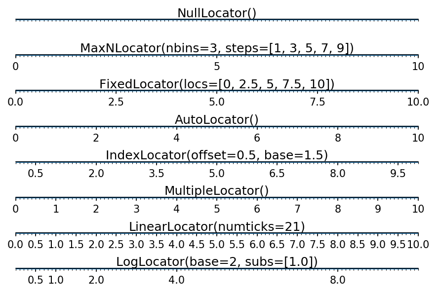


### 12. 刻度网格线
    ax = mp.gca()
    ax.grid(which='major'/'minor', axis='x'/'y'/'both',
        linewidth=线宽, linestyle=线型, color=颜色,
        alpha=透明度)


```python
# grid.py
import numpy as np
import matplotlib.pyplot as mp

x = np.linspace(-5, 5, 1000)
y = 8 * np.sinc(x)

mp.figure('Grid', dpi=150, facecolor='lightgray')
mp.title('Grid', fontsize=20)
mp.xlabel('x', fontsize=14)
mp.ylabel('y', fontsize=14)
mp.tick_params(labelsize=10)
mp.plot(x, y, c='dodgerblue', label=r'$y=8sinc(x)$')

ax = mp.gca()
ax.xaxis.set_major_locator(mp.MultipleLocator(1))
ax.xaxis.set_minor_locator(mp.MultipleLocator(0.1))
ax.yaxis.set_major_locator(mp.MultipleLocator(1))
ax.yaxis.set_minor_locator(mp.MultipleLocator(0.1))

ax.grid(which='major', axis='both', linewidth=0.75, linestyle='-', color='orange')
ax.grid(which='minor', axis='both', linewidth=0.25, linestyle='-', color='orange')

# mp.grid(linestyle=':')
mp.legend()
mp.tight_layout()
mp.show()
```


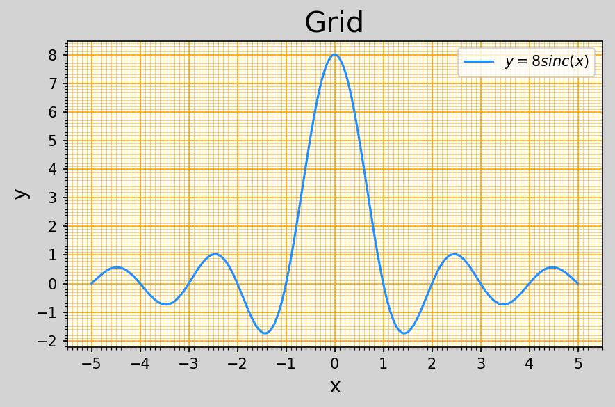


### 13. 半对数坐标
    mp.semilogy(参数同plot函数)


```python
# grid.py
import numpy as np
import matplotlib.pyplot as mp

y = np.array([1, 10, 100, 1000, 100, 10, 1])

mp.figure('Normal & Log', dpi=150, facecolor='lightgray')

mp.subplot(211)
mp.title('Normal', fontsize=20)
mp.xlabel('x', fontsize=14)
mp.ylabel('y', fontsize=14)
mp.tick_params(labelsize=10)
mp.plot(y, 'o-', c='dodgerblue', label=r'plot')

ax = mp.gca()
ax.xaxis.set_major_locator(mp.MultipleLocator(1))
ax.xaxis.set_minor_locator(mp.MultipleLocator(0.1))
ax.yaxis.set_major_locator(mp.MultipleLocator(250))
ax.yaxis.set_minor_locator(mp.MultipleLocator(50))
mp.tick_params(labelsize=10)

ax.grid(which='major', axis='both', linewidth=0.75, linestyle='-', color='orange')
ax.grid(which='minor', axis='both', linewidth=0.25, linestyle='-', color='orange')

# ----------------------------------------
mp.subplot(212)
mp.title('Log', fontsize=20)
mp.xlabel('x', fontsize=14)
mp.ylabel('y', fontsize=14)
mp.tick_params(labelsize=10)

ax2 = mp.gca()
ax2.xaxis.set_major_locator(mp.MultipleLocator(1))
ax2.xaxis.set_minor_locator(mp.MultipleLocator(0.1))
ax2.yaxis.set_major_locator(mp.AutoLocator())
ax2.yaxis.set_minor_locator(mp.AutoLocator())
mp.tick_params(labelsize=10)

ax2.grid(which='major', axis='both', linewidth=0.75, linestyle='-', color='orange')
ax2.grid(which='minor', axis='both', linewidth=0.25, linestyle='-', color='orange')

mp.semilogy(y, 'o-', c='dodgerblue', label=r'semilogy')

mp.legend()
mp.tight_layout()
mp.show()
```


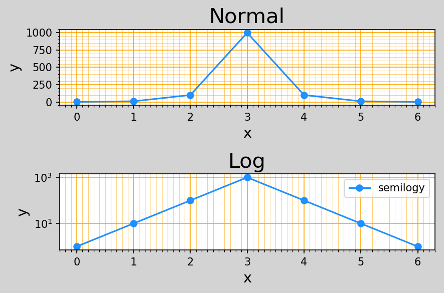


### 14. 散点图
- 可以通过每个点的坐标、颜色、大小和形状表示不同的特征值。

身高 | 性别 | 体重 | 年龄段 | 种族
:-: | :-: | :-: | :-: | :-:
1.8 | 80 | 男 | 中间 | 亚洲| 
1.6 | 50 | 女 | 青少 | 美洲|

- x、y、颜色、大小、形状


```python
# scatter.py
import numpy as np
import matplotlib.pyplot as mp
n = 1000
x = np.random.normal(0, 1, n)  # 标准正态分布
y = np.random.normal(0, 1, n)  # 标准正态分布
d = np.sqrt(x ** 2 + y ** 2)
mp.figure('Scatter', facecolor='lightgray')
mp.title('Scatter', fontsize=14)
mp.xlabel('x', fontsize=14)
mp.ylabel('y', fontsize=14)
mp.tick_params(labelsize=10)
mp.grid(linestyle=':')
mp.scatter(x, y, c=d, cmap='jet_r', s=60, alpha=0.5)  #  'jet_r'从深红到深蓝的渐变颜色表，根据d中的从小到大元素来选取
mp.tight_layout()
mp.show()
```


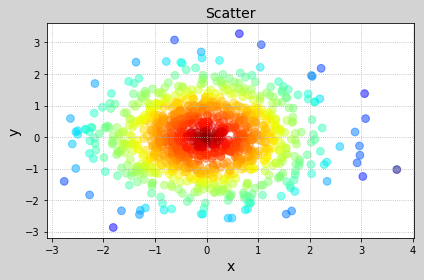


### 15. 填充
    mp.fill_between(
        边界曲线上点的水平坐标,
        下边界曲线上点的垂直坐标,
        上边界曲线上点的垂直坐标,
        填充条件, 
        color=颜色, alpha=透明度)


```python
# fill.py
import numpy as np
import matplotlib.pyplot as mp
n = 1000
x = np.linspace(0, 8 * np.pi, n)  # 标准正态分布
sin_y = np.sin(x)
cos_y = np.cos(x / 2) / 2
d = np.sqrt(x ** 2 + y ** 2)
mp.figure('Fill', facecolor='lightgray')
mp.title('Fill', fontsize=20)
mp.xlabel('x', fontsize=14)
mp.ylabel('y', fontsize=14)
mp.tick_params(labelsize=10)
mp.grid(linestyle=':')
mp.plot(x, sin_y, c='dodgerblue', label=r'$y=sin(x)$')
mp.plot(x, cos_y, c='orange', label=r'$y=\frac{1}{2}cos(\frac{x}{2}$')

mp.fill_between(x, cos_y, sin_y, cos_y < sin_y,
                color='dodgerblue', alpha=0.5)

mp.fill_between(x, cos_y, sin_y, cos_y > sin_y,
                color='orange', alpha=0.5)


mp.legend()
mp.tight_layout()
mp.show()
```


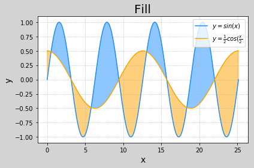


### 16. 条形图
    mp.bar(水平坐标, 高度, 宽度[, 底坐标], color=颜色, alpha=透明度, label=图例标签)


```python
# bar.py
# fill.py
import numpy as np
import matplotlib.pyplot as mp

apples = np.array([30, 25, 22, 36, 21, 29, 20, 24, 33, 19, 27, 15])
oranges = np.array([24, 33, 19, 27, 35, 20, 15, 27, 20, 32, 20, 22])


mp.figure('Bar', facecolor='lightgray')
mp.title('Bar', fontsize=20)
mp.xlabel('Month', fontsize=14)
mp.ylabel('Number', fontsize=14)
mp.tick_params(labelsize=10)
mp.grid(axis='y', linestyle=':')
mp.ylim((0, 40))

x = np.arange(len(apples))
mp.bar(x, apples, 0.6, color='dodgerblue', label='Apple')
mp.bar(x + 0.3, oranges, 0.6, color='orange', label='Orange', alpha=0.75)
mp.xticks(x, ['Jan', 'Feb', 'Mar', 'Apr', 'May', 'June', 'July', 'Aug', 'Sep', 'Oct', 'Nov', 'Dec'])

mp.legend()
mp.tight_layout()
mp.show()
```


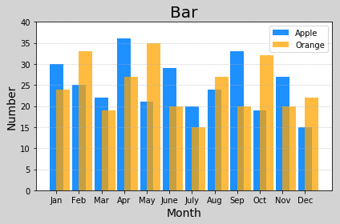


### 17. 饼图
    mp.pie(值, 间隙, 标签, 颜色, 格式,
        shadow=是否带阴影, startangel=起始角度)


```python
# pie.py
values = [26, 17, 21,29, 11]
spaces = [0.01, 0.01, 0.01, 0.01, 0.01]
lables = ['Python', 'JavaScript', 'C++', 'Java', 'PHP']
colors = ['dodgerblue', 'orange', 'limegreen', 'violet', 'gold']

mp.figure('Pie', facecolor='lightgray')
mp.title('Pie', fontsize=20)
mp.pie(values, spaces, lables, colors, '%d%%', shadow=True, startangle=45)

mp.legend()
mp.tight_layout()
# 等轴比例
mp.axis('equal')

mp.show()
```


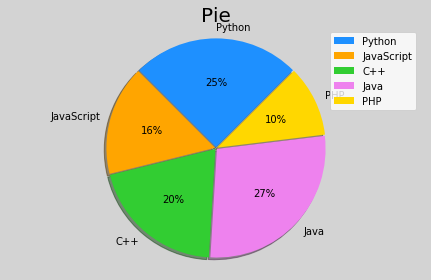


### 18. 等高线图
    mp.contourf(x, y, z, 阶数(密集成都), cmap=颜色映射)
    mp.contour(x, y, z, 阶数, linewidths=线宽)


```python
# cntr.py
import numpy as np
import matplotlib.pyplot as mp
n = 1000
# 网格化
x, y = np.meshgrid(np.linspace(-3, 3, n), np.linspace(-3, 3, n))
z = (1 - x / 2 + x ** 5 + y ** 3) * np.exp(-x ** 2 - y ** 2)

mp.figure('Contour', facecolor='lightgray')
mp.title('Contour', fontsize=14)
mp.xlabel('x', fontsize=14)
mp.ylabel('y', fontsize=14)
mp.tick_params(labelsize=10)
mp.grid(linestyle=':')

# 绘制等高线图
cnrt = mp.contour(x, y, z, 10, cmap='jet', linewidth=0.5)
# 为等高线图添加高度标签
mp.clabel(cnrt, inline_spacing=1, fmt='%.1f', fontsize=10)
mp.tight_layout()
mp.show()
```


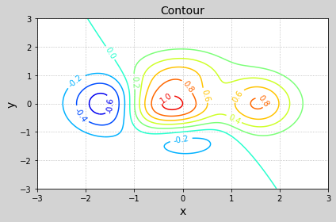


### 19. 热成像图
    用图形的方式显示矩阵
    1 2 3
    4 5 6
    7 8 9
    mp.imshow(矩阵, cmap=颜色映射, origin=纵轴方向
        hight: 缺省，原点在左上角
        low: 原点在左下角


```python
# hot.py
import numpy as np
import matplotlib.pyplot as mp
n = 1000
# 网格化
x, y = np.meshgrid(np.linspace(-3, 3, n), np.linspace(-3, 3, n))
z = (1 - x / 2 + x ** 5 + y ** 3) * np.exp(-x ** 2 - y ** 2)

mp.figure('Hot', facecolor='lightgray')
mp.title('Hot', fontsize=14)
mp.xlabel('x', fontsize=14)
mp.ylabel('y', fontsize=14)
mp.tick_params(labelsize=10)
mp.grid(linestyle=':')

# 绘制热成像图
mp.imshow(z, cmap='jet', origin='low')
mp.colorbar().set_label('z', fontsize=14)
mp.tight_layout()
mp.show()
```


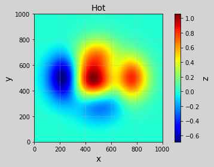


### 20. 极坐标系
    mp.gca(projection='polar')
    水平坐标 -> 极角
    垂直坐标 -> 极径
    mp.plot(水平坐标, 垂直坐标, ...)
    mp.plot(极角, 极径, ...)


```python
# polar.py
import numpy as np
import matplotlib.pyplot as mp

t = np.linspace(0, 4 * np.pi, 1001) # 720度
r_spiral = 0.8 * t
r_rose = 5 * np.sin(6 * t)

mp.figure('Polar', facecolor='lightgray')
mp.title('Polar', fontsize=20)
mp.xlabel(r'$\theta$', fontsize=14)
mp.ylabel(r'$\rho$', fontsize=14)
mp.tick_params(labelsize=10)
mp.grid(linestyle=':')

mp.plot(t, r_spiral, c='dodgerblue', label=r'$\rho=0.8\theta$')
mp.plot(t, r_rose, c='orange', label=r'$5sin(6\theta)$')
mp.legend()

# 函数值   = f (自变量)
# 垂直坐标 = f (水平坐标)
# 极径     = f (极角)

mp.figure('Flower', facecolor='lightgray')
mp.title('Flower', fontsize=20)
mp.xlabel(r'$\theta$', fontsize=14)
mp.ylabel(r'$\rho$', fontsize=14)
mp.tick_params(labelsize=10)
mp.grid(linestyle=':')

mp.gca(projection='polar')
mp.plot(t, r_spiral, c='dodgerblue', label=r'$\rho=0.8\theta$')
mp.plot(t, r_rose, c='orange', label=r'$5sin(6\theta)$')
mp.legend()

mp.show()
```


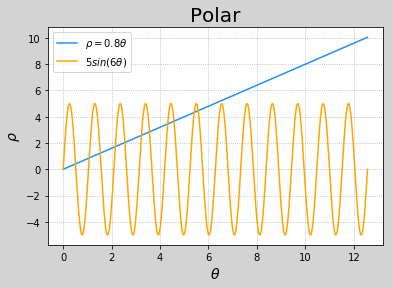


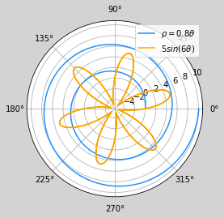


### 21. 三维曲面
    from mpl_toolkits.mplot3d import axes3d
    ax = mp.gca(projection='3d') # class axes3d
    ax.set_xlabel(...)
    ...
    ax.plot_surface(x, y, z, rstride=行跨距, cstride=列跨距,
        cmap=颜色映射)
    ax.plot_wireframe(x, y, z, rstride=行跨距, cstride=列跨距,
        linewidth=线宽, color=颜色)


```python
# 3d.py
import numpy as np
import matplotlib.pyplot as mp
from mpl_toolkits.mplot3d import axes3d

n = 1000
# 网格化
x, y = np.meshgrid(np.linspace(-3, 3, n), np.linspace(-3, 3, n))
z = (1 - x / 2 + x ** 5 + y ** 3) * np.exp(-x ** 2 - y ** 2)

mp.figure('3D Surface', facecolor='lightgray')
# 创建三维坐标系
ax = mp.gca(projection='3d')

mp.title('3D Surface', fontsize=14)
ax.set_xlabel('x', fontsize=14)
ax.set_ylabel('y', fontsize=14)
ax.set_zlabel('z', fontsize=14)
mp.tick_params(labelsize=10)
# 绘制三维表面图
ax.plot_surface(x, y, z, rstride=10, cstride=10, cmap='jet')

mp.figure('3D Wireframe', facecolor='lightgray')
# 创建三维坐标系
ax = mp.gca(projection='3d')

mp.title('3D Wireframe', fontsize=14)
ax.set_xlabel('x', fontsize=14)
ax.set_ylabel('y', fontsize=14)
ax.set_zlabel('z', fontsize=14)
mp.tick_params(labelsize=10)
# 绘制三维表面图
ax.plot_wireframe(x, y, z, rstride=10, cstride=10, linewidth=1, color='limegreen')


mp.tight_layout()
mp.show()
```


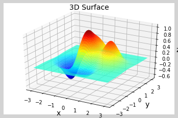


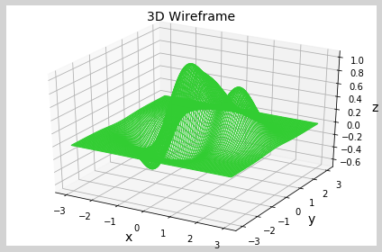


### 22. 简单动画
    import matplotlib.animation as ma
    def 更新回调函数(序列号):
        更新画面显示
        ...
    ma.FuncAnimation(图像窗口, 更新回调函数, interval=时间间隔(毫秒))
- 每经过一个"时间间隔"，"更新回调函数"会被matplotlib调用一次。

         位置         大小     生长                颜色
        float float | float | float | float float float float


```python
# bud.py
import numpy as np
import matplotlib.pyplot as mp
import matplotlib.animation as ma

n_bubbles = 100
# 气泡数组
bubbles = np.zeros(n_bubbles, dtype=[
    ('position', float, 2), # 位置
    ('size', float, 1), # 大小
    ('growth', float, 1), # 生长速度
    ('color', float, 4)]) # 颜色（红绿蓝透明度）

bubbles['position'] = np.random.uniform(0, 1, (n_bubbles, 2))
bubbles['size'] = np.random.uniform(50, 750, n_bubbles)
bubbles['growth'] = np.random.uniform(30, 150, n_bubbles)
bubbles['color'] = np.random.uniform(0, 1, (n_bubbles, 4))

mp.figure('Bubbles', facecolor='lightgray')
mp.title('Bubbles', fontsize=20)
mp.xticks(())
mp.yticks(())
sc = mp.scatter(bubbles['position'][:, 0],
                bubbles['position'][:, 1], s=bubbles['size'], c=bubbles['color'])

def update(number):
    # 更新气泡的大小
    bubbles['size'] += bubbles['growth']
    # 确定哪个气泡破裂
    burst = number % n_bubbles
    # 更新破裂气泡的位置
    bubbles['position'][burst] = np.random.uniform(0, 1, 2)
    # 更新破裂气泡的大小
    bubbles['size'][burst] = 0
    # 更新破裂气泡的生长速度
    bubbles['growth'][burst] = np.random.uniform(30, 150)
    # 更新破裂气泡的颜色
    bubbles['color'][burst] = np.random.uniform(0, 1, 4)    
    # 设置气泡的位置
    sc.set_offsets(bubbles['position'])
    # 设置气泡的大小
    sc.set_sizes(bubbles['size'])
    # 设置气泡的颜色
    sc.set_facecolors(bubbles['color'])
    
    
anim = ma.FuncAnimation(mp.gcf(), update, interval=10)

mp.show()
```


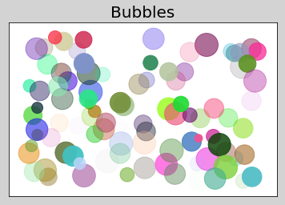


- 每经过一个"时间间隔"，matplotlib先调用"生成器函数"，用"生成器函数"产生(yeild)的值作为参数调用"更新回调函数"。
        matplotlib:
            ...
            while True:
                延时interval毫秒
                生成值 = 生成器函数()
                更新回调函数(生成值)
            ...


```python
# bud.py
import numpy as np
import matplotlib.pyplot as mp
import matplotlib.animation as ma


mp.figure('Signal', facecolor='lightgray')
mp.title('Signal', fontsize=20)
mp.xlabel('Time', fontsize=14)
mp.ylabel('Signal', fontsize=14)
ax = mp.gca()
ax.set_ylim(-3, 3)
ax.set_xlim(0, 10)
mp.tick_params(labelsize=10)
mp.grid(linestyle=':')

# 创建一个曲线对象
pl = mp.plot([], [], c='orange')[0]
# 在曲线对象内部创建缓冲区，以容纳曲线上点的横纵坐标
pl.set_data([], [])


# 更新回调函数
def update(data):
    t, v = data
    # 获取曲线上当前所有的点
    x, y = pl.get_data()
    # 追加新采集到的点
    x.append(t)
    y.append(v)
    # 获取当前水平坐标范围
    x_min, x_max = ax.get_xlim()
    # 如果新点的水平坐标超过水平坐标范围
    if t > x_max:
        # 重新设置水平坐标范围
        ax.set_xlim(t - (x_max - x_min), t)
        # 重新绘制坐标轴
        ax.figure.canvas.draw()
    # 设置曲线上的点
    pl.set_data(x, y)

# 生成器函数
def generator():
    t = 0
    while True:
        v = np.sin(2 * np.pi * t) * np.exp(np.sin(0.2 * np.pi * t))
        yield t, v
        t += 0.05
    
anim = ma.FuncAnimation(mp.gcf(), update, generator, interval=5)

mp.show()
```


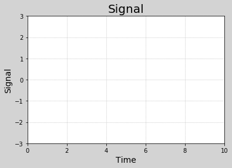

