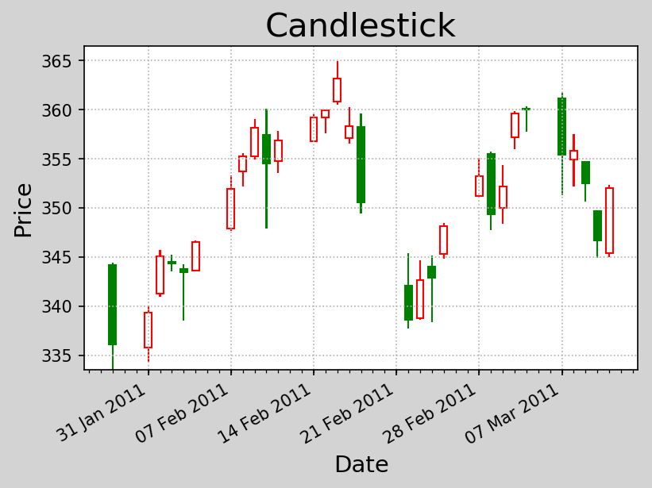
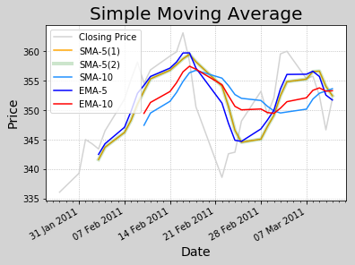
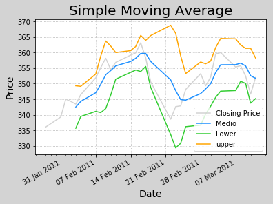
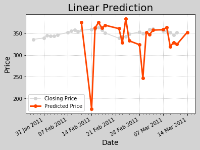
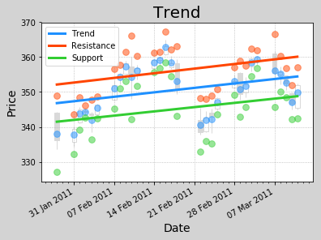

# 六、numpy的常用函数
---

### 1. 读取文件

- 逻辑上可被解释为二维数组的文本文件：
    - `数据项1<分隔符>数据项2<分隔符>...<分隔符>数据项n`
            numpy.loadtxt(
                文件路径,
                delimiter=分隔符(缺省一个空格),
                usecols=列序列(缺省所有列),
                unpack=是否展开列(缺省False),  # 返回一个二维数组(False)或多个一维数组(True)
      

          dtype=元素类型(缺省float),
                converters=转换器字典(缺省不做转换))


```python
# k.py
import numpy as np
import datetime as dt
import matplotlib.pyplot as mp
import matplotlib.dates as md

def dmy2ymd(dmy):
    dmy = str(dmy, encoding='utf-8')
    date = dt.datetime.strptime(dmy, '%d-%m-%Y').date()
    ymd = date.strftime('%Y-%m-%d')
    return ymd

dates, opening_prices, highest_prices, lowest_prices, closing_prices \
= np.loadtxt('../data/aapl.csv', delimiter=',', usecols=(1, 3, 4, 5, 6), unpack=True, dtype='M8[D], f8, f8, f8, f8', \
            converters={1: dmy2ymd})

mp.figure('Candlestick', dpi=150, facecolor='lightgray')
mp.title('Candlestick', fontsize=20)
mp.xlabel('Date', fontsize=14)
mp.ylabel('Price', fontsize=14)
ax = mp.gca()
# 设置水平坐标每个星期一为主刻度
ax.xaxis.set_major_locator(md.WeekdayLocator(byweekday=md.MO))
# 设置每一天为次刻度
ax.xaxis.set_minor_locator(md.DayLocator())
# 设置水平坐标主刻度标签格式
ax.xaxis.set_major_formatter(md.DateFormatter('%d %b %Y'))
mp.tick_params(labelsize=10)
mp.grid(linestyle=':')

dates = dates.astype(md.datetime.datetime)

rise = closing_prices - opening_prices >= 0.01 # 阳线掩码，为bool数组
fall = opening_prices - closing_prices >= 0.01 # 阴险掩码
# 填充色
fc = np.zeros(dates.size, dtype='3f4')
fc[rise], fc[fall] = (1, 1, 1), (0, 0.5, 0)  # 设置红色和浅绿色
# 边缘色
ec = np.zeros(dates.size, dtype='3f4')
ec[rise], ec[fall] = (1, 0, 0), (0, 0.5, 0)  # 设置红色和浅绿色

mp.bar(dates, highest_prices - lowest_prices, 0.01, lowest_prices, color=fc, edgecolor=ec)
mp.bar(dates, closing_prices - opening_prices, 0.6, opening_prices, color=fc, edgecolor=ec)

# 自动调整水平坐标轴的日期标签
mp.gcf().autofmt_xdate()
mp.show()
```





### 2. 算数平均值
- 样本：`S = [s1, s2, ..., sn]`
- 算数平均值：`m = (s1+s2+...+sn) / n`
        测      误差
        s1 = s+d1
        s2 = s+d2
        ...
        sn = s+dn
        m =(s1+s2+...+sn) / n
          =(s+s+...+s) / n + (d1+d2+...+dn)/n
          =s + (d1+d2+...+dn)/n
          n->oo
- 算数平均值表示对真值的无偏估计。

`numpy.mean(S)->m`


```python
# mean.py
import numpy as np
def dmy2ymd(dmy):
    dmy = str(dmy, encoding='utf-8')
    date = dt.datetime.strptime(dmy, '%d-%m-%Y').date()
    ymd = date.strftime('%Y-%m-%d')
    return ymd

dates, opening_prices, highest_prices, lowest_prices, closing_prices \
= np.loadtxt('../data/aapl.csv', delimiter=',', usecols=(1, 3, 4, 5, 6), unpack=True, dtype='M8[D], f8, f8, f8, f8', \
            converters={1: dmy2ymd})

mean = 0
for cp in closing_prices:
    mean += cp
mean /= closing_prices.size
print(mean)

mean = np.mean(closing_prices)
print(mean)
```

    351.03766666666667
    351.0376666666667


### 3. 加权平均值
- 样本：`S = [s1, s2, ..., sn]`
- 权重：`W = [w1, w2, ..., wn]`
- 加权平均值：
        a = (s1w1+s2w2+...+snwn)/(w1+w2+...+wn)
        numpy.average(S, weights=W)->a
- VWAP - 成交量加权平均价格
- TWAP - 时间加权平均价格


```python
# VWAP.py
import numpy as np

closing_prices, volumes = np.loadtxt('../data/aapl.csv', delimiter=',', usecols=(6, 7), unpack=True)

# 原始计算方法
vwap, wsum = 0, 0
for closing_price, volume in zip(closing_prices, volumes):
    vwap += closing_price * volume
    wsum += volume
vwap /= wsum
print(vwap)

vwap = np.average(closing_prices, weights=volumes)
print(vwap)
```

    350.5895493532009
    350.5895493532009


```python
# TWAP.py
import numpy as np
import datetime as dt

def dmy2days(dmy):
    dmy = str(dmy, encoding='utf-8')
    date = dt.datetime.strptime(dmy, '%d-%m-%Y').date()
    days = (date - dt.date.min).days
    return days

dates, closing_prices = np.loadtxt('../data/aapl.csv', delimiter=',', usecols=(1, 6), unpack=True, 
                                   converters={1:dmy2days})

twap = np.average(closing_prices, weights=dates)
print(twap)
```

    351.0377051146597


### 4. 最值
- max/min：返回一个数组中最大/最小元素
- argmax/argmin：返回一个数组中最大/最小元素的下标
- maximum/minimum：将两个同维数组中对应位置元素中最大/最小元素构成一个新的数组
- ptp：返回一个数组中最大值和最小值之差


```python
# max.py
import numpy as np
# 产生9个[10, 100)区间的随机数
a = np.random.randint(10, 100, 9).reshape(3, 3)
print(a)
print(np.max(a),np.min(a))
print(np.argmax(a), np.argmin(a))

b = np.random.randint(10, 100, 9).reshape(3, 3)
print(b)
print(np.maximum(a, b))
print(np.minimum(a, b))

print(np.ptp(a))
```

    [[70 48 99]
     [85 78 99]
     [97 41 86]]
    99 41
    2 7
    [[40 66 28]
     [34 11 90]
     [59 88 24]]
    [[70 66 99]
     [85 78 99]
     [97 88 86]]
    [[40 48 28]
     [34 11 90]
     [59 41 24]]
    58


```python
# range.py
import numpy as np
dates, highest_prices, lowest_prices = np.loadtxt('../data/aapl.csv', delimiter=',', usecols=(1, 4, 5), 
                                                  unpack=True, dtype='U10, f8, f8')
max_price = np.max(highest_prices)
min_price = np.min(lowest_prices)
print(min_price, 'to', max_price)

max_index = np.argmax(highest_prices)
min_index = np.argmin(lowest_prices)
print(dates[max_index], 'and', dates[min_index])

# 波动范围
r = highest_prices - lowest_prices
highest_ptp = np.ptp(highest_prices)
lowest_ptp = np.ptp(lowest_prices)
print(highest_ptp, 'and', lowest_ptp)
```

    333.53 to 364.9
    16-02-2011 and 28-01-2011
    24.859999999999957 and 26.970000000000027


### 5. 中位数
- 将多个样本按照大小排序，取中间位置的元素。
- np.median(无序样本)->中位数
        10 20 30 40 50
              ^ (a[(5-1)/2]+a[5/2])/2
        10 20 30 40 50 60
              ^   ^
              (a[(6-1)/2]+a[6/2])/2

- `(a[(s-1)/2]+a[s/2])/2`


```python
# med.py
import numpy as np
closing_prices = np.loadtxt('../data/aapl.csv', delimiter=',', usecols=(6))

size = closing_prices.size
sorted_prices = np.msort(closing_prices)
median = (sorted_prices[int((size - 1)/ 2)] + sorted_prices[int(size / 2)]) / 2
print(median)

median = np.median(closing_prices)
print(median)
```

    [336.1  339.32 345.03 344.32 343.44 346.5  351.88 355.2  358.16 354.54
     356.85 359.18 359.9  363.13 358.3  350.56 338.61 342.62 342.88 348.16
     353.21 349.31 352.12 359.56 360.   355.36 355.76 352.47 346.67 351.99]
    352.055
    352.055


### 6. 标准差
- 样本：S = [s1, s2, ..., sn]
- 平均值：m = (s1+s2+...+sn)/n
- 离差：D = [d1, d2, ..., dn], di = si-m
- 离差方：Q = [q1, q2, ..., qn], qi = di^2
- 总体方差：v = (q1+q2+...+qn)/n
- 总体标准差：s = sqrt(v)，方均根


- 样本方差：v' = (q1+q2+...+qn)/(n-1)
    - ${s^2} = \frac{1}{{n - 1}}(\sum\limits_{n - 1}^n {({x_i} - \bar x){)^2}}$
    - `numpy.std(S)`    
- 样本标准差：s' = sqrt(v')，方均根
    - `numpy.std(S, ddof=1)`   
    - ${s^2} = \frac{1}{{n - 1}}\sqrt {(\sum\limits_{n - 1}^n {({x_i} - \bar x){)^2}} }$  


```python
# var.py
import numpy as np
closing_prices = np.loadtxt('../data/aapl.csv', delimiter=',', usecols=(6))

mean = np.mean(closing_prices) # 算术平均值
devs = closing_prices - mean # 离差
dsqs = devs ** 2 # 离差方
pvar = np.mean(dsqs) # 总体方差
pstd = np.sqrt(pvar) # 总体标准差

svar = np.sum(dsqs) / (dsqs.size - 1) # 样本方差
sstd = np.sqrt(svar) # 样本标准差
print(pstd, sstd)

pstd = np.std(closing_prices)
sstd = np.std(closing_prices, ddof=1)
print(pstd, sstd)
```

    7.080008325481608 7.201042876260849
    7.080008325481608 7.201042876260849


### 7. 时间数据处理
1. 按星期取平均值


```python
# week.py
import numpy as np
import datetime as dt

# 转换器函数：日月年格式的字符串转换成星期
def dmy2wday(dmy):
    dmy = str(dmy, encoding='utf-8')
    date = dt.datetime.strptime(dmy, '%d-%m-%Y').date()
    wday = date.weekday() # 用0到6表示周一到周日
    return wday


wdays, closing_prices = np.loadtxt('../data/aapl.csv', delimiter=',', usecols=(1, 6), unpack=True, 
                                   converters={1: dmy2wday})
print(wdays)

ave_closing_prices = np.zeros(5)
for wday in range(ave_closing_prices.size):
    '''
    ave_closing_prices[wday] = np.take(
        closing_prices, np.where(wdays == wday)).mean()
    '''
    '''
    ave_closing_prices[wday] = \
        closing_prices[np.where(wdays == wday)].mean()
    '''
    ave_closing_prices[wday] = \
        closing_prices[wdays == wday].mean()
for wday, ave_closing_price in zip(
        ['MON', 'TUE', 'WED', 'THU', 'FRI'],
        ave_closing_prices):
    print(wday, np.round(ave_closing_price, 2))
```

    [4. 0. 1. 2. 3. 4. 0. 1. 2. 3. 4. 0. 1. 2. 3. 4. 1. 2. 3. 4. 0. 1. 2. 3.
     4. 0. 1. 2. 3. 4.]
    MON 351.79
    TUE 350.64
    WED 352.14
    THU 350.9
    FRI 350.02


2. 按星期汇总数据
    - 数组的轴向汇总
    - `np.apply_along_axis(处理函数, 轴向, 数组)`
    - 沿着数组中所指定的轴向，调用处理函数，并将每次调用的返回值重新组织成数组返回。


```python
# axis.py
import numpy as np


def foo(arg):
    print('foo', arg)
    return arg.sum()

a = np.arange(1, 10).reshape(3, 3)
print(a)
b = np.apply_along_axis(foo, 0, a)
print(b)
c = np.apply_along_axis(foo, 1, a)
print(c)
```

    [[1 2 3]
     [4 5 6]
     [7 8 9]]
    foo [1 4 7]
    foo [2 5 8]
    foo [3 6 9]
    [12 15 18]
    foo [1 2 3]
    foo [4 5 6]
    foo [7 8 9]
    [ 6 15 24]


```python
# sum.py
import numpy as np
import datetime as dt

def dmy2wday(dmy):
    dmy = str(dmy, encoding='utf-8')
    date = dt.datetime.strptime(dmy, '%d-%m-%Y').date()
    wday = date.weekday()
    return wday


wdays, opening_prices, highest_prices, \
    lowest_prices, closing_prices = np.loadtxt(
        '../data/aapl.csv',
        delimiter=',', usecols=(1, 3, 4, 5, 6),
        unpack=True, converters={1: dmy2wday})

wdays = wdays[:16]
opening_prices = opening_prices[:16]
highest_prices = highest_prices[:16]
lowest_prices = lowest_prices[:16]
closing_prices = closing_prices[:16]

# 第一个星期一的索引
first_monday = np.where(wdays == 0)[0][0]
last_friday = np.where(wdays == 4)[0][-1]
indices = np.arange(first_monday, last_friday + 1)
indices = np.split(indices, 3)

def week_summary(indices):
    opening_price = opening_prices[indices[0]]
    highest_price = highest_prices[indices].max()
    lowest_price = lowest_prices[indices].min()
    closing_price = closing_prices[indices[-1]]
    return opening_price, highest_price, \
        lowest_price, closing_price

summaries = np.apply_along_axis(
    week_summary, 1, indices)
print(summaries)
np.savetxt('../data/summary.csv', summaries, delimiter=',', fmt='%g')
```

    [[335.8  346.7  334.3  346.5 ]
     [347.89 360.   347.64 356.85]
     [356.79 364.9  349.52 350.56]]


### 8. 卷积
- 卷积积分
- 激励函数：$g(t)$
- 单位激励下的响应函数：$f(t)$
- 响应函数：$\int{g(t)f(t)dt}$

        a = [1 2 3 4 5]
        b = [6 7 8]
        c = numpy.convolve(a, b, 卷积类型)
        
                              40   61   82            - 有效卷积(valid)
                         19   40   61   82   67       - 同维卷积(same)
                    6    19   40   61   82   67   40  - 完全卷积(full) 
          0    0    1    2    3    4    5    0    0
          8    7    6
               8    7    6
                    8    7    6
                         8    7    6
                              8    7    6
                                   8    7    6
                                        8    7    6


```python
# conv.py
import numpy as np
a = np.arange(1, 6) # 被卷积序列
b = np.arange(6, 9) # 卷积核序列
print(a, b)
c = np.convolve(a, b, 'full')
print(c)
d = np.convolve(a, b, 'same')
print(d)
e = np.convolve(a, b, 'valid')
print(e)
```

    [1 2 3 4 5] [6 7 8]
    [ 6 19 40 61 82 67 40]
    [19 40 61 82 67]
    [40 61 82]


### 9. 移动均线
    简单平均
    a b c d e f g h i j [1/5 1/5 1/5 1/5 1/5] 卷积核
    (a+b+c+d+e)/5
    (b+c+d+e+f)/5
    (c+d+e+f+g)/5
    ...
    (f+g+h+i+j)/5
    
    指数平均，加权平均
    [A, B, C, D, E]
    S=A+B+C+D+E
    (aA+bB+cC+dD+eE)/S
    aA/S+bB/S+cC/S+dD/S+eE/S
    [A/S, B/S, C/S, D/S, E/S] 卷积核


```python
# smaema.py
import numpy as np
import datetime as dt
import matplotlib.pyplot as mp
import matplotlib.dates as md

def dmy2ymd(dmy):
    dmy = str(dmy, encoding='utf-8')
    date = dt.datetime.strptime(dmy, '%d-%m-%Y').date()
    ymd = date.strftime('%Y-%m-%d')
    return ymd

dates, closing_prices = np.loadtxt('../data/aapl.csv', delimiter=',', usecols=(1, 6), unpack=True, dtype='M8[D], f8', 
            converters={1: dmy2ymd})

# SMA1普通方法
sma51 = np.zeros(closing_prices.size - 4)
for i in range(sma51.size):
    sma51[i] = closing_prices[i:i+5].mean()
# SMA2卷积方法
sma52 = np.convolve(closing_prices, np.ones(5)/5, 'valid')
sma10 = np.convolve(closing_prices, np.ones(10)/10, 'valid')

# EMA卷积方法
weights = np.exp(np.linspace(-1, 0, 5))
weights /= weights.sum()
ema5 = np.convolve(closing_prices, weights[::-1], 'valid')
weights = np.exp(np.linspace(-1, 0, 10))
weights /= weights.sum()
ema10 = np.convolve(closing_prices, weights[::-1], 'valid')


mp.figure('Simple Moving Average', facecolor='lightgray')
mp.title('Simple Moving Average', fontsize=20)
mp.xlabel('Date', fontsize=14)
mp.ylabel('Price', fontsize=14)
ax = mp.gca()
# 设置水平坐标每个星期一为主刻度
ax.xaxis.set_major_locator(md.WeekdayLocator(byweekday=md.MO))
# 设置每一天为次刻度
ax.xaxis.set_minor_locator(md.DayLocator())
# 设置水平坐标主刻度标签格式
ax.xaxis.set_major_formatter(md.DateFormatter('%d %b %Y'))
mp.tick_params(labelsize=10)
mp.grid(linestyle=':')

dates = dates.astype(md.datetime.datetime)

mp.plot(dates, closing_prices, c='lightgray', label='Closing Price')
mp.plot(dates[4:], sma51, c='orange', label='SMA-5(1)')
mp.plot(dates[4:], sma52, c='green', label='SMA-5(2)', alpha=0.2, linewidth=4)
mp.plot(dates[9:], sma10, c='dodgerblue', label='SMA-10')
mp.plot(dates[4:], ema5, c='blue', label='EMA-5')
mp.plot(dates[9:], ema10, c='red', label='EMA-10')


# 自动调整水平坐标轴的日期标签
mp.gcf().autofmt_xdate()
mp.legend()
mp.show()
```





### 10. 布林带
- 中轨：移动平均线
- 上轨：中轨+2x标准差
- 下轨：中轨-2x标准差


```python
# ebb.py
import numpy as np
import datetime as dt
import matplotlib.pyplot as mp
import matplotlib.dates as md

def dmy2ymd(dmy):
    dmy = str(dmy, encoding='utf-8')
    date = dt.datetime.strptime(dmy, '%d-%m-%Y').date()
    ymd = date.strftime('%Y-%m-%d')
    return ymd

dates, closing_prices = np.loadtxt('../data/aapl.csv', delimiter=',', usecols=(1, 6), unpack=True, dtype='M8[D], f8', 
            converters={1: dmy2ymd})


weights = np.exp(np.linspace(-1, 0, 5))
weights /= weights.sum()
medios = np.convolve(closing_prices, weights[::-1], 'valid')
stds = np.zeros(medios.size)
for i in range(stds.size):
    stds[i] = closing_prices[i:i+5].std()
stds *= 2
lowers = medios - stds
uppers = medios + stds


mp.figure('Simple Moving Average', facecolor='lightgray')
mp.title('Simple Moving Average', fontsize=20)
mp.xlabel('Date', fontsize=14)
mp.ylabel('Price', fontsize=14)
ax = mp.gca()
# 设置水平坐标每个星期一为主刻度
ax.xaxis.set_major_locator(md.WeekdayLocator(byweekday=md.MO))
# 设置每一天为次刻度
ax.xaxis.set_minor_locator(md.DayLocator())
# 设置水平坐标主刻度标签格式
ax.xaxis.set_major_formatter(md.DateFormatter('%d %b %Y'))
mp.tick_params(labelsize=10)
mp.grid(linestyle=':')

dates = dates.astype(md.datetime.datetime)

mp.plot(dates, closing_prices, c='lightgray', label='Closing Price')
mp.plot(dates[4:], medios, c='Dodgerblue', label='Medio')
mp.plot(dates[4:], lowers, c='limegreen', label='Lower')
mp.plot(dates[4:], uppers, c='orange', label='upper')


# 自动调整水平坐标轴的日期标签
mp.gcf().autofmt_xdate()
mp.legend()
mp.show()
```





### 11. 线性模型
    1    2   3    4      5
    60   65  70   75    <80>

1. 线性预测
        a b c d e f
        aA+bB+cC=d \
        bA+cB+dC=e  > -> 求A B C
        cA+dB+eC=f /
        dA+eB+fC -> ?

$\left( {\begin{array}{*{20}{c}}
a&b&c\\
b&c&d\\
c&d&e
\end{array}} \right)\left( {\begin{array}{*{20}{c}}
A\\
B\\
C
\end{array}} \right) = \left( {\begin{array}{*{20}{c}}
d\\
e\\
f
\end{array}} \right)$

- `np.linalg.lstsq(a, b)[0]`


```python
# ebb.py
import numpy as np
import datetime as dt
import pandas as pd
import matplotlib.pyplot as mp
import matplotlib.dates as md

def dmy2ymd(dmy):
    dmy = str(dmy, encoding='utf-8')
    date = dt.datetime.strptime(dmy, '%d-%m-%Y').date()
    ymd = date.strftime('%Y-%m-%d')
    return ymd

dates, closing_prices = np.loadtxt('../data/aapl.csv', delimiter=',', usecols=(1, 6), unpack=True, dtype='M8[D], f8', 
            converters={1: dmy2ymd})

N = 5
pred_prices = np.zeros(
    closing_prices.size - 2 * N + 1)
for i in range(pred_prices.size):
    a = np.zeros((N, N))
    for j in range(N):
        a[j, ] = closing_prices[i + j:i + j + N]
    b = closing_prices[i + N:i + N * 2]
    x = np.linalg.lstsq(a, b)[0]
    pred_prices[i] = b.dot(x)
mp.figure('Linear Prediction',
          facecolor='lightgray')
mp.title('Linear Prediction', fontsize=20)
mp.xlabel('Date', fontsize=14)
mp.ylabel('Price', fontsize=14)
ax = mp.gca()
# 设置水平坐标每个星期一为主刻度
ax.xaxis.set_major_locator(md.WeekdayLocator(
    byweekday=md.MO))
# 设置水平坐标每一天为次刻度
ax.xaxis.set_minor_locator(md.DayLocator())
# 设置水平坐标主刻度标签格式
ax.xaxis.set_major_formatter(md.DateFormatter(
    '%d %b %Y'))
mp.tick_params(labelsize=10)
mp.grid(linestyle=':')
dates = dates.astype(md.datetime.datetime)
mp.plot(dates, closing_prices, 'o-', c='lightgray',
        label='Closing Price')
dates = np.append(dates,
                  dates[-1] + pd.tseries.offsets.BDay())
mp.plot(dates[2 * N:], pred_prices, 'o-',
        c='orangered', linewidth=3,
        label='Predicted Price')
mp.legend()
mp.gcf().autofmt_xdate()
mp.show()
```

    /Users/haoen110/miniconda3/lib/python3.7/site-packages/ipykernel_launcher.py:25: FutureWarning: `rcond` parameter will change to the default of machine precision times ``max(M, N)`` where M and N are the input matrix dimensions.
    To use the future default and silence this warning we advise to pass `rcond=None`, to keep using the old, explicitly pass `rcond=-1`.
    /Users/haoen110/miniconda3/lib/python3.7/site-packages/pandas/plotting/_converter.py:129: FutureWarning: Using an implicitly registered datetime converter for a matplotlib plotting method. The converter was registered by pandas on import. Future versions of pandas will require you to explicitly register matplotlib converters.
    
    To register the converters:
    	>>> from pandas.plotting import register_matplotlib_converters
    	>>> register_matplotlib_converters()
      warnings.warn(msg, FutureWarning)





2. 线性拟合
        kx + b = y
        kx1 + b = y1
        kx2 + b = y2
        ...
        kxn + b = yn
        / x1 1 \    / k \    / y1 \
        | x2 1 | X  | b | =  | y2 |
        | ...  |    \   /    | ...|
        \ xn 1/              \ yn /
            a        x           b
                      = np.linalg.lstsq(a, b)[0]
        y = kx + b
        kx1 + b = y1' - y1
        kx2 + b = y2' - y2
        ...
        kxn + b = yn' - yn
        [y1 - (kx1 + b)]^2 +
        [y2 - (kx2 + b)]^2 + ... +
        [yn - (kxn + b)]^2 = loss = f(k, b)
        k, b? -> loss ->min


```python
import datetime as dt
import numpy as np
import matplotlib.pyplot as mp
import matplotlib.dates as md


def dmy2ymd(dmy):
    dmy = str(dmy, encoding='utf-8')
    date = dt.datetime.strptime(
        dmy, '%d-%m-%Y').date()
    ymd = date.strftime('%Y-%m-%d')
    return ymd


dates, opening_prices, highest_prices, \
    lowest_prices, closing_prices = np.loadtxt(
        '../data/aapl.csv', delimiter=',',
        usecols=(1, 3, 4, 5, 6), unpack=True,
        dtype='M8[D], f8, f8, f8, f8',
        converters={1: dmy2ymd})
trend_points = (highest_prices + lowest_prices +
                closing_prices) / 3
spreads = highest_prices - lowest_prices
resistance_points = trend_points + spreads
support_points = trend_points - spreads
days = dates.astype(int)
a = np.column_stack((days, np.ones_like(days)))
x = np.linalg.lstsq(a, trend_points)[0]
trend_line = days * x[0] + x[1]
x = np.linalg.lstsq(a, resistance_points)[0]
resistance_line = days * x[0] + x[1]
x = np.linalg.lstsq(a, support_points)[0]
support_line = days * x[0] + x[1]
mp.figure('Trend', facecolor='lightgray')
mp.title('Trend', fontsize=20)
mp.xlabel('Date', fontsize=14)
mp.ylabel('Price', fontsize=14)
ax = mp.gca()
ax.xaxis.set_major_locator(md.WeekdayLocator(
    byweekday=md.MO))
ax.xaxis.set_minor_locator(md.DayLocator())
ax.xaxis.set_major_formatter(md.DateFormatter(
    '%d %b %Y'))
mp.tick_params(labelsize=10)
mp.grid(linestyle=':')
dates = dates.astype(md.datetime.datetime)
rise = closing_prices - opening_prices >= 0.01
fall = opening_prices - closing_prices >= 0.01
fc = np.zeros(dates.size, dtype='3f4')
ec = np.zeros(dates.size, dtype='3f4')
fc[rise], fc[fall] = (1, 1, 1), (0.85, 0.85, 0.85)
ec[rise], ec[fall] = (0.85, 0.85, 0.85), (0.85, 0.85, 0.85)
mp.bar(dates, highest_prices - lowest_prices, 0,
       lowest_prices, color=fc, edgecolor=ec)
mp.bar(dates, closing_prices - opening_prices, 0.8,
       opening_prices, color=fc, edgecolor=ec)
mp.scatter(dates, trend_points, c='dodgerblue',
           alpha=0.5, s=60, zorder=2)
mp.plot(dates, trend_line, c='dodgerblue',
        linewidth=3, label='Trend')
mp.scatter(dates, resistance_points, c='orangered',
           alpha=0.5, s=60, zorder=2)
mp.plot(dates, resistance_line, c='orangered',
        linewidth=3, label='Resistance')
mp.scatter(dates, support_points, c='limegreen',
           alpha=0.5, s=60, zorder=2)
mp.plot(dates, support_line, c='limegreen',
        linewidth=3, label='Support')
mp.legend()
mp.gcf().autofmt_xdate()
mp.show()

```

    /Users/haoen110/miniconda3/lib/python3.7/site-packages/ipykernel_launcher.py:28: FutureWarning: `rcond` parameter will change to the default of machine precision times ``max(M, N)`` where M and N are the input matrix dimensions.
    To use the future default and silence this warning we advise to pass `rcond=None`, to keep using the old, explicitly pass `rcond=-1`.
    /Users/haoen110/miniconda3/lib/python3.7/site-packages/ipykernel_launcher.py:30: FutureWarning: `rcond` parameter will change to the default of machine precision times ``max(M, N)`` where M and N are the input matrix dimensions.
    To use the future default and silence this warning we advise to pass `rcond=None`, to keep using the old, explicitly pass `rcond=-1`.
    /Users/haoen110/miniconda3/lib/python3.7/site-packages/ipykernel_launcher.py:32: FutureWarning: `rcond` parameter will change to the default of machine precision times ``max(M, N)`` where M and N are the input matrix dimensions.
    To use the future default and silence this warning we advise to pass `rcond=None`, to keep using the old, explicitly pass `rcond=-1`.





```python

```
