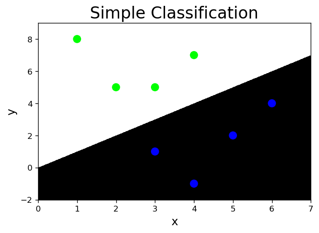
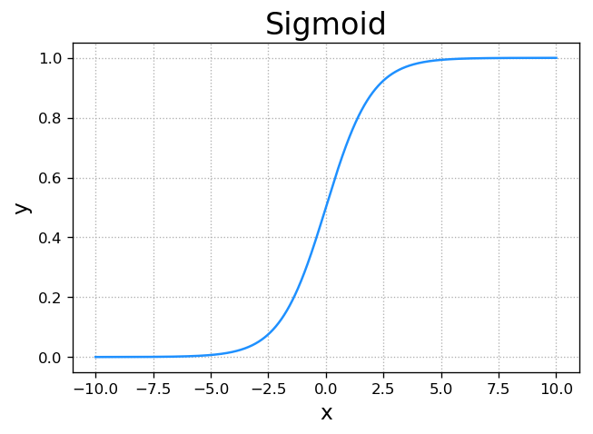
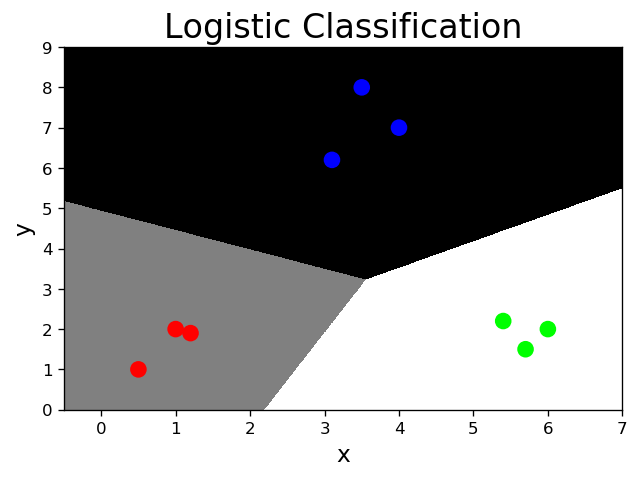
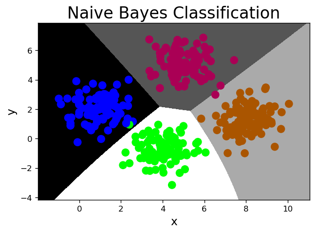
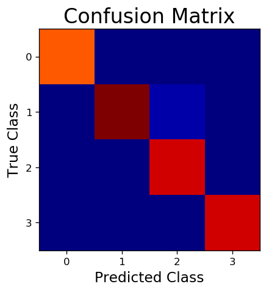
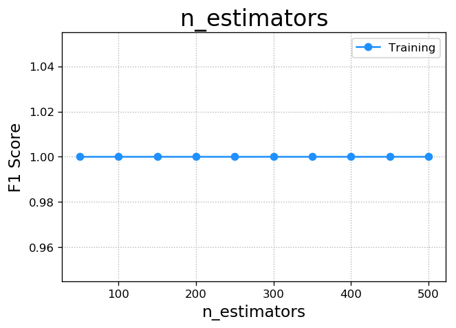
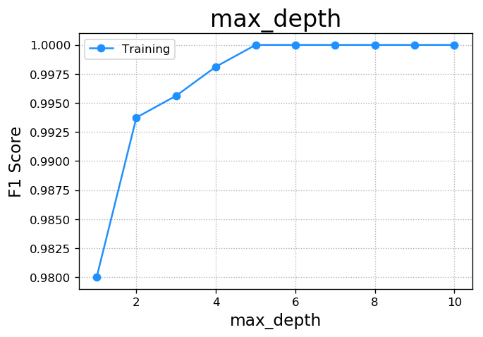
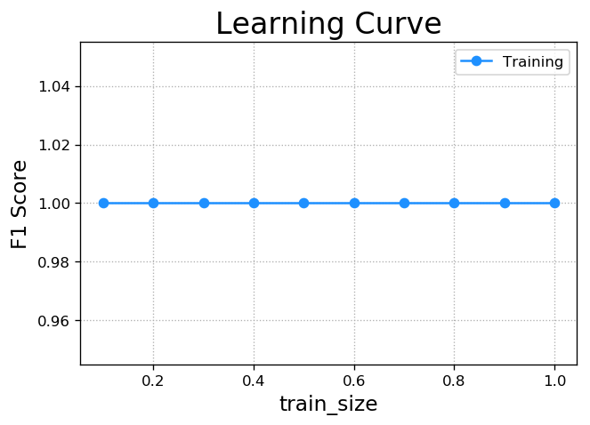

# 八、人工分类


输入1 |输入2 | 输出 |
:-:|:-:|:-:|
3 |1   |0
2 |5   |1
1 |8   |1
6 |4   |0
5 |2   |0
3 |5   |1
4 |7   |1
4 |-1  |0
6 |8 |？
5 |1 |？


```python
import numpy as np
import matplotlib.pyplot as mp
x = np.array([
    [3, 1],
    [2, 5],
    [1, 8],
    [6, 4],
    [5, 2],
    [3, 5],
    [4, 7],
    [4, -1]])
y = np.array([0, 1, 1, 0, 0, 1, 1, 0])

# l左边界，r右边界，h水平边界
l, r, h = x[:, 0].min() - 1, x[:, 0].max() + 1, 0.005
# 
b, t, v = x[:, 1].min() - 1, x[:, 1].max() + 1, 0.005

grid_x = np.meshgrid(np.arange(l, r, h), np.arange(b, t, v))
flat_x = np.c_[grid_x[0].ravel(), grid_x[1].ravel()]
flat_y = np.zeros(len(flat_x), dtype=int)
flat_y[flat_x[:, 0] < flat_x[:, 1]] = 1
grid_y = flat_y.reshape(grid_x[0].shape)

mp.figure('Simple Classification', dpi=120)
mp.title('Simple Classification', fontsize=20)
mp.xlabel('x', fontsize=14)
mp.ylabel('y', fontsize=14)
mp.tick_params(labelsize=10)
mp.pcolormesh(grid_x[0], grid_x[1], grid_y, cmap='gray')
mp.scatter(x[:, 0], x[:, 1], c=y, cmap='brg', s=80)

mp.show()
```





# 九、逻辑分类

$$y = w_0+w_1x_1+w_2x_2$$

- 连续的预测值->离散的预测值，使用逻辑函数：

$$sigmoid=\frac{1}{1+e^-x}$$


```python
import numpy as np
import matplotlib.pyplot as mp
x = np.linspace(-10, 10, 1000)
y = 1 / (1 + np.exp(-x))
mp.figure('Sigmoid', dpi=120)
mp.title('Sigmoid', fontsize=20)
mp.xlabel('x', fontsize=14)
mp.ylabel('y', fontsize=14)
mp.tick_params(labelsize=10)
mp.grid(linestyle=':')
mp.plot(x, y, c='dodgerblue')
mp.show()
```





- 非线性化

$$y=\frac{1}{1+e^-(w0+w1x1+w2x2)}$$

- 将预测函数的输出看做输入被划分为1类的概率，择概率大的类别作为预测结果。

输入1|输入2|概率|预测结果|
:-:|:-:|:-:|:-:|
3|1|0.2|0
2|5|0.8|1
1|8|0.7|1
6|4|0.3|0


```python
import numpy as np
import sklearn.linear_model as lm
import matplotlib.pyplot as mp
x = np.array([
    [3, 1],
    [2, 5],
    [1, 8],
    [6, 4],
    [5, 2],
    [3, 5],
    [4, 7],
    [4, -1]])
y = np.array([0, 1, 1, 0, 0, 1, 1, 0])

# 逻辑分类器
model = lm.LogisticRegression(solver='liblinear', C=1)  # C为正则强度
model.fit(x, y)
l, r, h = x[:, 0].min() - 1, x[:, 0].max() + 1, 0.005
b, t, v = x[:, 1].min() - 1, x[:, 1].max() + 1, 0.005
grid_x = np.meshgrid(np.arange(l, r, h), np.arange(b, t, v))
flat_x = np.c_[grid_x[0].ravel(), grid_x[1].ravel()]
flat_y = model.predict(flat_x)
grid_y = flat_y.reshape(grid_x[0].shape)

mp.figure('Logistic Classification', dpi=120)
mp.title('Logistic Classification', fontsize=20)
mp.xlabel('x', fontsize=14)
mp.ylabel('y', fontsize=14)
mp.tick_params(labelsize=10)
mp.pcolormesh(grid_x[0], grid_x[1], grid_y, cmap='gray')
mp.scatter(x[:, 0], x[:, 1], c=y, cmap='brg', s=80)

mp.show()
```


- 多元分类，通过过个二元分类来进行


```python
import numpy as np
import sklearn.linear_model as lm
import matplotlib.pyplot as mp
x = np.array([
    [4, 7],
    [3.5, 8],
    [3.1, 6.2],
    [0.5, 1],
    [1, 2],
    [1.2, 1.9],
    [6, 2],
    [5.7, 1.5],
    [5.4, 2.2]])
y = np.array([0, 0, 0, 1, 1, 1, 2, 2, 2])

# 逻辑分类器
model = lm.LogisticRegression(solver='liblinear', C=1000)
model.fit(x, y)
l, r, h = x[:, 0].min() - 1, x[:, 0].max() + 1, 0.005
b, t, v = x[:, 1].min() - 1, x[:, 1].max() + 1, 0.005
grid_x = np.meshgrid(np.arange(l, r, h), np.arange(b, t, v))
flat_x = np.c_[grid_x[0].ravel(), grid_x[1].ravel()]
flat_y = model.predict(flat_x)
grid_y = flat_y.reshape(grid_x[0].shape)

mp.figure('Logistic Classification', dpi=120)
mp.title('Logistic Classification', fontsize=20)
mp.xlabel('x', fontsize=14)
mp.ylabel('y', fontsize=14)
mp.tick_params(labelsize=10)
mp.pcolormesh(grid_x[0], grid_x[1], grid_y, cmap='gray')
mp.scatter(x[:, 0], x[:, 1], c=y, cmap='brg', s=80)

mp.show()
```

    /Users/haoen110/miniconda3/lib/python3.7/site-packages/sklearn/linear_model/logistic.py:469: FutureWarning: Default multi_class will be changed to 'auto' in 0.22. Specify the multi_class option to silence this warning.
      "this warning.", FutureWarning)





# 十、朴素贝叶斯分类

### 1. 算法原理

- 贝叶斯定理：

$$P(A|B)=\frac{P(A)P(B|A)}{P(B)}$$

$$P(A|B)P(B)=P(B|A)P(A)$$

$$P(A,B)=P(B,A)$$
              
$$P(C|x)=\frac{P(C)P(x|C)}{P(x)}$$
                    
$$P(C)P(x|C)\\
=P(C,x)\\
=P(C,x1,x2)\\
=P(x1,x2,C)\\
=P(x1|x2,C)P(x2,C)\\
=P(x1|x2,C)P(x2|C)P(C)\\
朴素：条件独立假设：\\
=P(x1|C)P(x2|C)P(C)$$


```python
import numpy as np
import sklearn.naive_bayes as nb
import matplotlib.pyplot as mp
x, y = [], []
with open('../data/multiple1.txt', 'r') as f:
    for line in f.readlines():
        data = [float(substr) for substr
                in line.split(',')]
        x.append(data[:-1])
        y.append(data[-1])
x = np.array(x)
y = np.array(y, dtype=int)

# 朴素贝叶斯分类器
model = nb.GaussianNB()
model.fit(x, y)
l, r, h = x[:, 0].min() - 1, x[:, 0].max() + 1, 0.005
b, t, v = x[:, 1].min() - 1, x[:, 1].max() + 1, 0.005
grid_x = np.meshgrid(np.arange(l, r, h), np.arange(b, t, v))
flat_x = np.c_[grid_x[0].ravel(), grid_x[1].ravel()]
flat_y = model.predict(flat_x)
grid_y = flat_y.reshape(grid_x[0].shape)
pred_y = model.predict(x)
print((pred_y == y).sum() / pred_y.size)

mp.figure('Naive Bayes Classification', dpi=120)
mp.title('Naive Bayes Classification', fontsize=20)
mp.xlabel('x', fontsize=14)
mp.ylabel('y', fontsize=14)
mp.tick_params(labelsize=10)
mp.pcolormesh(grid_x[0], grid_x[1], grid_y, cmap='gray')
mp.scatter(x[:, 0], x[:, 1], c=y, cmap='brg', s=80)

mp.show()
```

    0.995





### 2. 划分训练集和测试集
    import sklearn.model_selection as ms
    ms.train_test_split(输入集, 输出集, test_size=测试集占比,ramdom_state=随机种子) 
    ->训练输入, 测试输入, 训练输出, 测试输出


```python
# 划分训练集和测试集
train_x, test_x, train_y, test_y = ms.train_test_split(x, y, test_size=0.25, random_state=7)

# 朴素贝叶斯分类器
model = nb.GaussianNB()

# 用训练集训练模型
model.fit(train_x, train_y)
l, r, h = x[:, 0].min() - 1, x[:, 0].max() + 1, 0.005
b, t, v = x[:, 1].min() - 1, x[:, 1].max() + 1, 0.005
grid_x = np.meshgrid(np.arange(l, r, h), np.arange(b, t, v))
flat_x = np.c_[grid_x[0].ravel(), grid_x[1].ravel()]
flat_y = model.predict(flat_x)
grid_y = flat_y.reshape(grid_x[0].shape)

# 用测试集测试模型
pred_test_y = model.predict(test_x)
print((pred_test_y == test_y).sum() / pred_test_y.size)
```

    0.99


### 3. 交叉验证

    ms.cross_val_score(模型, 输入集, 输出集, cv=折叠数, scoring=指标名) -> 指标值数组

- 指标：

1. 精确度(accuracy)：分类正确的样本数/总样本数

2. 查准率(precision_weighted)：针对每一个类别，预测正确的样本数比上预测出来的样本数

3. 召回率(recall_weighted)：针对每一个类别，预测正确的样本数比上实际存在的样本数

4. f1得分(f1_weighted)：

    - 2x查准率x召回率/(查准率+召回率)

- 在交叉验证过程中，针对每一个折叠，计算所有类别的查准率、召回率或者f1得分，然后取各类别相应指标值的平均数，作为这一个折叠的评估指标，然后再将所有折叠的评估指标以数组的形式返回调用者。


```python
# 交叉验证
# 精确度
ac = ms.cross_val_score(
    model, train_x, train_y, cv=5,
    scoring='accuracy')
print(ac.mean())
# 查准率
pw = ms.cross_val_score(
    model, train_x, train_y, cv=5,
    scoring='precision_weighted')
print(pw.mean())
# 召回率
rw = ms.cross_val_score(
    model, train_x, train_y, cv=5,
    scoring='recall_weighted')
print(rw.mean())
# f1得分
fw = ms.cross_val_score(
    model, train_x, train_y, cv=5,
    scoring='f1_weighted')
print(fw.mean())
# 用训练集训练模型
model.fit(train_x, train_y)
l, r, h = x[:, 0].min() - 1, x[:, 0].max() + 1, 0.005
b, t, v = x[:, 1].min() - 1, x[:, 1].max() + 1, 0.005
grid_x = np.meshgrid(np.arange(l, r, h), np.arange(b, t, v))
flat_x = np.c_[grid_x[0].ravel(), grid_x[1].ravel()]
flat_y = model.predict(flat_x)
grid_y = flat_y.reshape(grid_x[0].shape)
# 用测试集测试模型
pred_test_y = model.predict(test_x)
print((pred_test_y == test_y).sum() / pred_test_y.size)
```

    0.9966101694915255
    0.996822033898305
    0.9966101694915255
    0.9966063988235516
    0.99


### 4. 混淆矩阵

- 每一行和每一列分别对应样本输出中的每一个类别，行表示实际类别，列表示预测类别。

            A B C
         A  5 0 0
         B  0 6 0 - 理想混淆矩阵
         C  0 0 7

            A B C
         A  3 1 1
         B  0 4 2
         C  0 0 7

$$\frac{主对角线上的值}{该值所在列的和}=查准率$$

$$\frac{主对角线上的值}{该值所在行的和}=召回率$$

- `sm.confusion_matrix(实际输出, 预测输出)` -> 混淆矩阵


```python
import sklearn.metrics as sm
# 获取混淆矩阵
cm = sm.confusion_matrix(test_y, pred_test_y)
print(cm)

mp.figure('Confusion Matrix', dpi=120)
mp.title('Confusion Matrix', fontsize=20)
mp.xlabel('Predicted Class', fontsize=14)
mp.ylabel('True Class', fontsize=14)
mp.xticks(np.unique(pred_test_y))
mp.yticks(np.unique(test_y))
mp.tick_params(labelsize=10)
mp.imshow(cm, interpolation='nearest', cmap='jet')
mp.show()
```

    [[22  0  0  0]
     [ 0 27  1  0]
     [ 0  0 25  0]
     [ 0  0  0 25]]





### 5. 分类报告
    
    sm.classification_report(实际输出, 预测输出)->分类报告


```python
print(cm)
cr = sm.classification_report(test_y, pred_test_y)
print(cr)
```

    [[22  0  0  0]
     [ 0 27  1  0]
     [ 0  0 25  0]
     [ 0  0  0 25]]
                  precision    recall  f1-score   support
    
               0       1.00      1.00      1.00        22
               1       1.00      0.96      0.98        28
               2       0.96      1.00      0.98        25
               3       1.00      1.00      1.00        25
    
        accuracy                           0.99       100
       macro avg       0.99      0.99      0.99       100
    weighted avg       0.99      0.99      0.99       100
    


# 十一、决策树分类

### 1. 以叶子表的投票结果确定预测类别。


```python
import numpy as np
import sklearn.preprocessing as sp
import sklearn.ensemble as se
import sklearn.model_selection as ms

# 读取数据
data = []
with open('../data/car.txt', 'r') as f:
    for line in f.readlines():
        data.append(line[:-1].split(','))
data = np.array(data).T
print(data)
```

    [['vhigh' 'vhigh' 'vhigh' ... 'low' 'low' 'low']
     ['vhigh' 'vhigh' 'vhigh' ... 'low' 'low' 'low']
     ['2' '2' '2' ... '5more' '5more' '5more']
     ...
     ['small' 'small' 'small' ... 'big' 'big' 'big']
     ['low' 'med' 'high' ... 'low' 'med' 'high']
     ['unacc' 'unacc' 'unacc' ... 'unacc' 'good' 'vgood']]


```python
encoders, train_x = [], []
for row in range(len(data)):
    encoder = sp.LabelEncoder()
    if row < len(data) - 1:
        train_x.append(encoder.fit_transform(data[row]))
    else:
        train_y = encoder.fit_transform(data[row])
    encoders.append(encoder)
train_x = np.array(train_x).T
# 随机森林分类器
model = se.RandomForestClassifier(max_depth=9, n_estimators=200, random_state=7)
print(ms.cross_val_score(model, train_x, train_y, cv=2, scoring='f1_weighted').mean())
model.fit(train_x, train_y)

data = [
    ['high', 'med', '5more', '4', 'big', 'low', 'unacc'],
    ['high', 'high', '4', '4', 'med', 'med', 'acc'],
    ['low', 'low', '2', '4', 'small', 'high', 'good'],
    ['low', 'med', '3', '4', 'med', 'high', 'vgood']]
data = np.array(data).T
test_x = []
for row in range(len(data)):
    encoder = encoders[row]
    if row < len(data) - 1:
        test_x.append(
            encoder.transform(data[row]))
    else:
        test_y = encoder.transform(data[row])
test_x = np.array(test_x).T
pred_test_y = model.predict(test_x)
print((pred_test_y == test_y).sum() / pred_test_y.size)
print(encoders[-1].inverse_transform(test_y))
print(encoders[-1].inverse_transform(pred_test_y))
```

    0.6947482874634467
    1.0
    ['unacc' 'acc' 'good' 'vgood']
    ['unacc' 'acc' 'good' 'vgood']


### 2. 验证曲线

- 模型性能 = f(超参数)

- `ms.validation_curve(模型, 输入集, 输出集, 超参数名, 超参数序列，cv=折叠数)` -> 训练集得分, 测试集得分


```python
# 获得关于n_estimators的验证曲线
model = se.RandomForestClassifier(max_depth=6, random_state=7)
n_estimators = np.arange(50, 550, 50)
train_scores, test_scores = ms.validation_curve(model, x, y, 'n_estimators', n_estimators, cv=5)
train_means1 = train_scores.mean(axis=1)
for param, score in zip(n_estimators, train_means1):
    print(param, '->', score)
    
# 获得关于max_depth的验证曲线
model = se.RandomForestClassifier(n_estimators=200, random_state=7)
max_depth = np.arange(1, 11)
train_scores, test_scores = ms.validation_curve(model, x, y, 'max_depth', max_depth, cv=5)
train_means2 = train_scores.mean(axis=1)
for param, score in zip(max_depth, train_means2):
    print(param, '->', score)
    
mp.figure('n_estimators', dpi=120)
mp.title('n_estimators', fontsize=20)
mp.xlabel('n_estimators', fontsize=14)
mp.ylabel('F1 Score', fontsize=14)
mp.tick_params(labelsize=10)
mp.grid(linestyle=':')
mp.plot(n_estimators, train_means1, 'o-', c='dodgerblue', label='Training')
mp.legend()

mp.figure('max_depth', dpi=120)
mp.title('max_depth', fontsize=20)
mp.xlabel('max_depth', fontsize=14)
mp.ylabel('F1 Score', fontsize=14)
mp.tick_params(labelsize=10)
mp.grid(linestyle=':')
mp.plot(max_depth, train_means2, 'o-', c='dodgerblue', label='Training')

mp.legend()
mp.show()
```

    50 -> 1.0
    100 -> 1.0
    150 -> 1.0
    200 -> 1.0
    250 -> 1.0
    300 -> 1.0
    350 -> 1.0
    400 -> 1.0
    450 -> 1.0
    500 -> 1.0
    1 -> 0.9799999999999999
    2 -> 0.99375
    3 -> 0.9956249999999999
    4 -> 0.9981249999999999
    5 -> 1.0
    6 -> 1.0
    7 -> 1.0
    8 -> 1.0
    9 -> 1.0
    10 -> 1.0








### 3. 学习曲线

- 模型性能 = f(训练集大小)

- `ms.learning_curve(模型, 输入集, 输出集, train_sizes=训练集大小序列，cv=折叠数)` -> 训练集大小序列, 训练集得分, 测试集得分


```python
# 获得学习曲线
model = se.RandomForestClassifier(max_depth=9, n_estimators=200, random_state=7)
train_sizes = np.linspace(0.1, 1, 10)
_, train_scores, test_scores = ms.learning_curve(model, x, y, train_sizes=train_sizes, cv=5)
train_means = train_scores.mean(axis=1)
for size, score in zip(train_sizes, train_means):
    print(size, '->', score)
    
mp.figure('Learning Curve', dpi=120)
mp.title('Learning Curve', fontsize=20)
mp.xlabel('train_size', fontsize=14)
mp.ylabel('F1 Score', fontsize=14)
mp.tick_params(labelsize=10)
mp.grid(linestyle=':')
mp.plot(train_sizes, train_means, 'o-',
        c='dodgerblue', label='Training')

mp.legend()
mp.show()
```

    0.1 -> 1.0
    0.2 -> 1.0
    0.30000000000000004 -> 1.0
    0.4 -> 1.0
    0.5 -> 1.0
    0.6 -> 1.0
    0.7000000000000001 -> 1.0
    0.8 -> 1.0
    0.9 -> 1.0
    1.0 -> 1.0





### 4. 针对不同形式的特征选择不同类型的编码器


```python
import numpy as np
import sklearn.preprocessing as sp
import sklearn.model_selection as ms
import sklearn.naive_bayes as nb

# 39, State-gov, 77516, Bachelors, 13, Never-married, Adm-clerical, Not-in-family, White, Male, 2174, 0, 40, United-States, <=50K
# 50, Self-emp-not-inc, 83311, Bachelors, 13, Married-civ-spouse, Exec-managerial, Husband, White, Male, 0, 0, 13, United-States, <=50K


class DigitEncoder():

    def fit_transform(self, y):
        return y.astype(int)

    def transform(self, y):
        return y.astype(int)

    def inverse_transform(self, y):
        return y.astype(str)


num_less, num_more, max_each = 0, 0, 7500
data = []
with open('../data/adult.txt', 'r') as f:
    for line in f.readlines():
        if '?' not in line:
            line_data = line[:-1].split(', ')
            if line_data[-1] == '<=50K' and \
                    num_less < max_each:
                data.append(line_data)
                num_less += 1
            elif line_data[-1] == '>50K' and \
                    num_more < max_each:
                data.append(line_data)
                num_more += 1
            if num_less >= max_each and \
                    num_more >= max_each:
                break
data = np.array(data).T
encoders, x = [], []
for row in range(len(data)):
    if data[row, 0].isdigit():
        encoder = DigitEncoder()
    else:
        encoder = sp.LabelEncoder()
    if row < len(data) - 1:
        x.append(encoder.fit_transform(data[row]))
    else:
        y = encoder.fit_transform(data[row])
    encoders.append(encoder)
x = np.array(x).T
train_x, test_x, train_y, test_y = ms.train_test_split(
    x, y, test_size=0.25, random_state=5)
model = nb.GaussianNB()
print(ms.cross_val_score(
    model, x, y, cv=10, scoring='f1_weighted').mean())
model.fit(train_x, train_y)
pred_test_y = model.predict(test_x)
print((pred_test_y == test_y).sum() / pred_test_y.size)
data = [['39', 'State-gov', '77516', 'Bachelors',
         '13', 'Never-married', 'Adm-clerical', 'Not-in-family',
         'White', 'Male', '2174', '0', '40', 'United-States']]
data = np.array(data).T
x = []
for row in range(len(data)):
    encoder = encoders[row]
    x.append(encoder.transform(data[row]))
x = np.array(x).T
pred_y = model.predict(x)
print(encoders[-1].inverse_transform(pred_y))
```

    0.5854102634001921
    0.6168
    ['<=50K']

