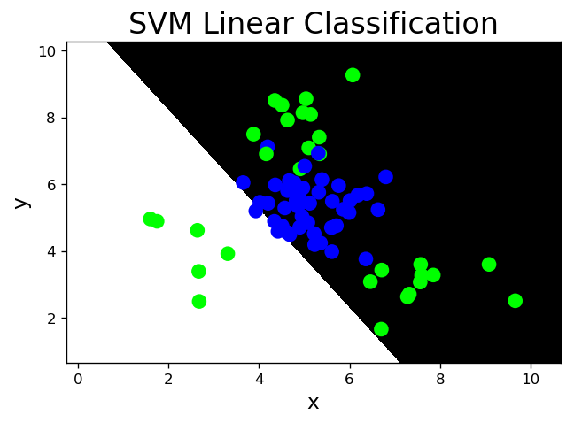
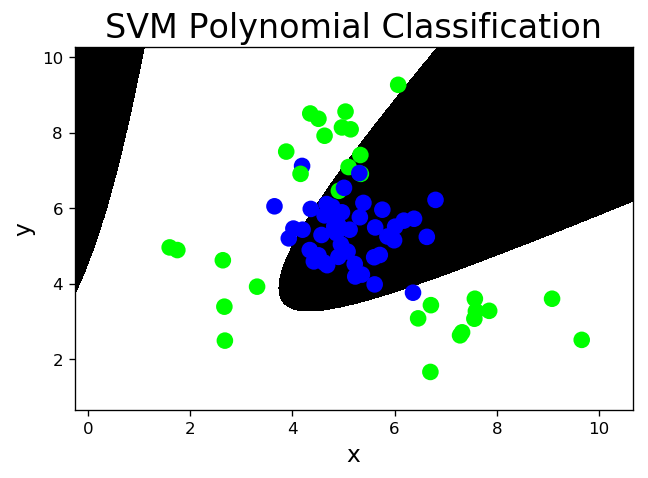
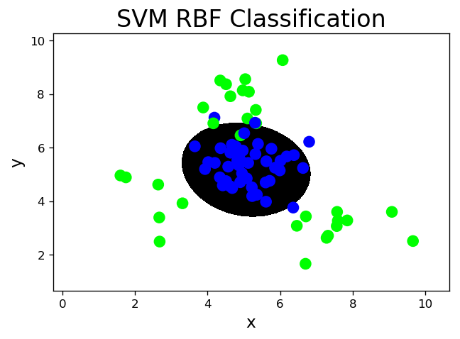
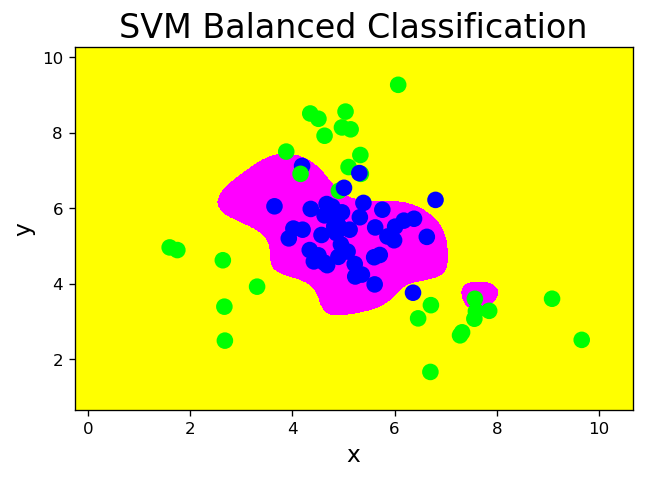
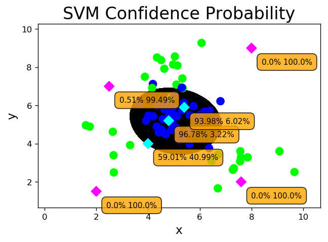
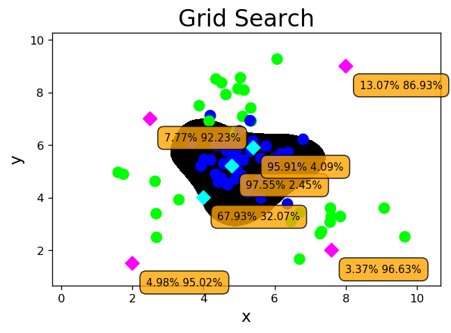

# 十二、支持向量机(SVM)

### 1. 原理

1. 寻求最优分类边界：

    - **正确**：对大部分样本可以正确地划分类别。

    - **泛化**：最大化支持向量间距。

    - **公平**：与支持向量等距。

    - **简单**：线性，直线或平面，分割超平面。


2. 基于核函数的升维变换：

    - 通过名为核函数的特征变换，增加新的特征，使得低维度空间中的线性不可分问题变为高维度空间中的线性可分问题。


### 2. 不同核函数的分类效果

1. 线性核函数：linear，不通过核函数进行维度提升，尽在原始维度空间中寻求线性分类边界。


```python
# svm_line.py
import numpy as np
import sklearn.model_selection as ms
import sklearn.svm as svm
import sklearn.metrics as sm
import matplotlib.pyplot as mp

x, y = [], []
with open('../data/multiple2.txt', 'r') as f:
    for line in f.readlines():
        data = [float(substr) for substr in line.split(',')]
        x.append(data[:-1])
        y.append(data[-1])
x = np.array(x)
y = np.array(y, dtype=int)
train_x, test_x, train_y, test_y = ms.train_test_split(x, y, test_size=0.25, random_state=5)

# 基于线性核函数的支持向量机分类器
model = svm.SVC(kernel='linear')
model.fit(train_x, train_y)
l, r, h = x[:, 0].min() - 1, x[:, 0].max() + 1, 0.005
b, t, v = x[:, 1].min() - 1, x[:, 1].max() + 1, 0.005
grid_x = np.meshgrid(np.arange(l, r, h), np.arange(b, t, v))
flat_x = np.c_[grid_x[0].ravel(), grid_x[1].ravel()]
flat_y = model.predict(flat_x)
grid_y = flat_y.reshape(grid_x[0].shape)
pred_test_y = model.predict(test_x)
cr = sm.classification_report(test_y, pred_test_y)
print(cr)
mp.figure('SVM Linear Classification', dpi=120)
mp.title('SVM Linear Classification', fontsize=20)
mp.xlabel('x', fontsize=14)
mp.ylabel('y', fontsize=14)
mp.tick_params(labelsize=10)
mp.pcolormesh(grid_x[0], grid_x[1], grid_y, cmap='gray')
mp.scatter(test_x[:, 0], test_x[:, 1], c=test_y, cmap='brg', s=80)
mp.show()
```

                  precision    recall  f1-score   support
    
               0       0.64      0.96      0.77        45
               1       0.75      0.20      0.32        30
    
        accuracy                           0.65        75
       macro avg       0.70      0.58      0.54        75
    weighted avg       0.69      0.65      0.59        75
    





2. 多项式核函数：poly，通过多项式函数增加原始样本特征的高次方幂

$x1 x2 -> y$

$x1 x2 x1^2 x1x2 x2^2 -> y$ 2次多项式升维

$x1 x2 x1^3 x1^2x2 x1x2^2 x2^3 -> y$ 3次多项式升维


```python
# svm_poly.py
# 基于3次多项式核函数的支持向量机分类器
model = svm.SVC(kernel='poly', degree=3)
model.fit(train_x, train_y)
l, r, h = x[:, 0].min() - 1, x[:, 0].max() + 1, 0.005
b, t, v = x[:, 1].min() - 1, x[:, 1].max() + 1, 0.005
grid_x = np.meshgrid(np.arange(l, r, h), np.arange(b, t, v))
flat_x = np.c_[grid_x[0].ravel(), grid_x[1].ravel()]
flat_y = model.predict(flat_x)
grid_y = flat_y.reshape(grid_x[0].shape)
pred_test_y = model.predict(test_x)
cr = sm.classification_report(test_y, pred_test_y)
print(cr)
mp.figure('SVM Polynomial Classification', dpi=120)
mp.title('SVM Polynomial Classification', fontsize=20)
mp.xlabel('x', fontsize=14)
mp.ylabel('y', fontsize=14)
mp.tick_params(labelsize=10)
mp.pcolormesh(grid_x[0], grid_x[1], grid_y, cmap='gray')
mp.scatter(test_x[:, 0], test_x[:, 1], c=test_y, cmap='brg', s=80)
mp.show()
```

    /Users/haoen110/miniconda3/lib/python3.7/site-packages/sklearn/svm/base.py:193: FutureWarning: The default value of gamma will change from 'auto' to 'scale' in version 0.22 to account better for unscaled features. Set gamma explicitly to 'auto' or 'scale' to avoid this warning.
      "avoid this warning.", FutureWarning)


                  precision    recall  f1-score   support
    
               0       0.91      0.87      0.89        45
               1       0.81      0.87      0.84        30
    
        accuracy                           0.87        75
       macro avg       0.86      0.87      0.86        75
    weighted avg       0.87      0.87      0.87        75
    





3. 径向基核函数：rbf，通过高斯分布函数增加原始样本特征的分布概率


```python
# svm_rbf.py
# 基于径向基核函数的支持向量机分类器
model = svm.SVC(kernel='rbf', C=600, gamma=0.01)
model.fit(train_x, train_y)
l, r, h = x[:, 0].min() - 1, x[:, 0].max() + 1, 0.005
b, t, v = x[:, 1].min() - 1, x[:, 1].max() + 1, 0.005
grid_x = np.meshgrid(np.arange(l, r, h), np.arange(b, t, v))
flat_x = np.c_[grid_x[0].ravel(), grid_x[1].ravel()]
flat_y = model.predict(flat_x)
grid_y = flat_y.reshape(grid_x[0].shape)
pred_test_y = model.predict(test_x)
cr = sm.classification_report(test_y, pred_test_y)
print(cr)
mp.figure('SVM RBF Classification', dpi=120)
mp.title('SVM RBF Classification', fontsize=20)
mp.xlabel('x', fontsize=14)
mp.ylabel('y', fontsize=14)
mp.tick_params(labelsize=10)
mp.pcolormesh(grid_x[0], grid_x[1], grid_y, cmap='gray')
mp.scatter(test_x[:, 0], test_x[:, 1], c=test_y, cmap='brg', s=80)
mp.show()
```

                  precision    recall  f1-score   support
    
               0       0.98      0.91      0.94        45
               1       0.88      0.97      0.92        30
    
        accuracy                           0.93        75
       macro avg       0.93      0.94      0.93        75
    weighted avg       0.94      0.93      0.93        75
    





### 3. 样本类别均衡化

    ..., class_weight='balanced', ...

- 通过类别权重的均衡化，使所占比例较小的样本权重较高，而所占比例较大的样本权重较低，以此平均化不同类别样本对分类模型的贡献，提高模型性能。


```python
# svm_bal.py
# 带有类别权重均衡的支持向量机分类器
model = svm.SVC(kernel='rbf', C=100, gamma=1, class_weight='balanced')
model.fit(train_x, train_y)
l, r, h = x[:, 0].min() - 1, x[:, 0].max() + 1, 0.005
b, t, v = x[:, 1].min() - 1, x[:, 1].max() + 1, 0.005
grid_x = np.meshgrid(np.arange(l, r, h), np.arange(b, t, v))
flat_x = np.c_[grid_x[0].ravel(), grid_x[1].ravel()]
flat_y = model.predict(flat_x)
grid_y = flat_y.reshape(grid_x[0].shape)
pred_test_y = model.predict(test_x)
cr = sm.classification_report(test_y, pred_test_y)
print(cr)
mp.figure('SVM Balanced Classification', dpi=120)
mp.title('SVM Balanced Classification', fontsize=20)
mp.xlabel('x', fontsize=14)
mp.ylabel('y', fontsize=14)
mp.tick_params(labelsize=10)
mp.pcolormesh(grid_x[0], grid_x[1], grid_y, cmap='spring')
mp.scatter(test_x[:, 0], test_x[:, 1], c=test_y, cmap='brg', s=80)
mp.show()
```

                  precision    recall  f1-score   support
    
               0       0.93      0.91      0.92        45
               1       0.87      0.90      0.89        30
    
        accuracy                           0.91        75
       macro avg       0.90      0.91      0.90        75
    weighted avg       0.91      0.91      0.91        75
    





### 4. 置信概率

- 根据样本与分类边界的距离远近，对其预测类别的可信程度进行量化，离边界越近的样本，置信概率越高，反之，离边界越远的样本，置信概率越低。

        构造model时指定参数，probability=True
        model.predict_proba(输入样本矩阵)->置信概率矩阵
        
        预测结果(model.predict()函数返回)：
        样本1 类别1
        样本2 类别1
        样本3 类别2
        
        置信概率矩阵：
              类别1 类别2
        样本1 0.8     0.2
        样本2 0.9     0.1
        样本3 0.4     0.5


```python
# svm_prob.py
# 能够计算置信概率的支持向量机分类器
model = svm.SVC(kernel='rbf', C=600, gamma=0.01,
                probability=True)
model.fit(train_x, train_y)
l, r, h = x[:, 0].min() - 1, x[:, 0].max() + 1, 0.005
b, t, v = x[:, 1].min() - 1, x[:, 1].max() + 1, 0.005
grid_x = np.meshgrid(np.arange(l, r, h), np.arange(b, t, v))
flat_x = np.c_[grid_x[0].ravel(), grid_x[1].ravel()]
flat_y = model.predict(flat_x)
grid_y = flat_y.reshape(grid_x[0].shape)
pred_test_y = model.predict(test_x)
cr = sm.classification_report(test_y, pred_test_y)
print(cr)
prob_x = np.array([
    [2, 1.5],
    [8, 9],
    [4.8, 5.2],
    [4, 4],
    [2.5, 7],
    [7.6, 2],
    [5.4, 5.9]])
print(prob_x)
pred_prob_y = model.predict(prob_x)
print(pred_prob_y)
probs = model.predict_proba(prob_x)
print(probs)
mp.figure('SVM Confidence Probability', dpi=120)
mp.title('SVM Confidence Probability', fontsize=20)
mp.xlabel('x', fontsize=14)
mp.ylabel('y', fontsize=14)
mp.tick_params(labelsize=10)
mp.pcolormesh(grid_x[0], grid_x[1], grid_y, cmap='gray')
mp.scatter(test_x[:, 0], test_x[:, 1], c=test_y, cmap='brg', s=80)
mp.scatter(prob_x[:, 0], prob_x[:, 1], c=pred_prob_y, cmap='cool', s=70, marker='D')
for i in range(len(probs)):
    mp.annotate(
        '{}% {}%'.format(
            round(probs[i, 0] * 100, 2),
            round(probs[i, 1] * 100, 2)),
        xy=(prob_x[i, 0], prob_x[i, 1]),
        xytext=(12, -12),
        textcoords='offset points',
        horizontalalignment='left',
        verticalalignment='top',
        fontsize=9,
        bbox={'boxstyle': 'round,pad=0.6',
              'fc': 'orange', 'alpha': 0.8})
mp.show()
```

                  precision    recall  f1-score   support
    
               0       0.98      0.91      0.94        45
               1       0.88      0.97      0.92        30
    
        accuracy                           0.93        75
       macro avg       0.93      0.94      0.93        75
    weighted avg       0.94      0.93      0.93        75
    
    [[2.  1.5]
     [8.  9. ]
     [4.8 5.2]
     [4.  4. ]
     [2.5 7. ]
     [7.6 2. ]
     [5.4 5.9]]
    [1 1 0 0 1 1 0]
    [[3.00000090e-14 1.00000000e+00]
     [3.00000090e-14 1.00000000e+00]
     [9.67771568e-01 3.22284319e-02]
     [5.90127228e-01 4.09872772e-01]
     [5.13650760e-03 9.94863492e-01]
     [3.13832983e-10 1.00000000e+00]
     [9.39755320e-01 6.02446797e-02]]





### 5. 网格搜索

    ms.GridSearchCV(模型, 超参数组合列表, cv=折叠数) ->模型对象
    模型对象.fit(输入集，输出集)
    
- 针对超参数组合列表中的每一个超参数组合，实例化给定的模型，做cv次交叉验证，将其中平均f1得分最高的超参数组合作为最佳选择，实例化模型对象。


```python
# svm_gs.py
# 超参数组合列表
params = [
    {'kernel': ['linear'], 'C': [1, 10, 100, 1000]},
    {'kernel': ['poly'], 'C': [1], 'degree': [2, 3]},
    {'kernel': ['rbf'], 'C': [1, 10, 100, 1000],
     'gamma': [1, 0.1, 0.01, 0.001]}]
# 网格搜索寻优
model = ms.GridSearchCV(
    svm.SVC(probability=True), params, cv=5)
model.fit(train_x, train_y)
for param, score in zip(
        model.cv_results_['params'],
        model.cv_results_['mean_test_score']):
    print(param, score)
print(model.best_params_)
print(model.best_score_)
print(model.best_estimator_)
l, r, h = x[:, 0].min() - 1, x[:, 0].max() + 1, 0.005
b, t, v = x[:, 1].min() - 1, x[:, 1].max() + 1, 0.005
grid_x = np.meshgrid(np.arange(l, r, h),
                     np.arange(b, t, v))
flat_x = np.c_[grid_x[0].ravel(), grid_x[1].ravel()]
flat_y = model.predict(flat_x)
grid_y = flat_y.reshape(grid_x[0].shape)
pred_test_y = model.predict(test_x)
cr = sm.classification_report(test_y, pred_test_y)
print(cr)
prob_x = np.array([
    [2, 1.5],
    [8, 9],
    [4.8, 5.2],
    [4, 4],
    [2.5, 7],
    [7.6, 2],
    [5.4, 5.9]])
print(prob_x)
pred_prob_y = model.predict(prob_x)
print(pred_prob_y)
probs = model.predict_proba(prob_x)
print(probs)
mp.figure('Grid Search', dpi=120)
mp.title('Grid Search', fontsize=20)
mp.xlabel('x', fontsize=14)
mp.ylabel('y', fontsize=14)
mp.tick_params(labelsize=10)
mp.pcolormesh(grid_x[0], grid_x[1], grid_y, cmap='gray')
mp.scatter(test_x[:, 0], test_x[:, 1], c=test_y, cmap='brg', s=80)
mp.scatter(prob_x[:, 0], prob_x[:, 1], c=pred_prob_y, cmap='cool', s=70, marker='D')
for i in range(len(probs)):
    mp.annotate(
        '{}% {}%'.format(
            round(probs[i, 0] * 100, 2),
            round(probs[i, 1] * 100, 2)),
        xy=(prob_x[i, 0], prob_x[i, 1]),
        xytext=(12, -12),
        textcoords='offset points',
        horizontalalignment='left',
        verticalalignment='top',
        fontsize=9,
        bbox={'boxstyle': 'round,pad=0.6',
              'fc': 'orange', 'alpha': 0.8})
mp.show()
```

    /Users/haoen110/miniconda3/lib/python3.7/site-packages/sklearn/svm/base.py:193: FutureWarning: The default value of gamma will change from 'auto' to 'scale' in version 0.22 to account better for unscaled features. Set gamma explicitly to 'auto' or 'scale' to avoid this warning.
      "avoid this warning.", FutureWarning)
    /Users/haoen110/miniconda3/lib/python3.7/site-packages/sklearn/svm/base.py:193: FutureWarning: The default value of gamma will change from 'auto' to 'scale' in version 0.22 to account better for unscaled features. Set gamma explicitly to 'auto' or 'scale' to avoid this warning.
      "avoid this warning.", FutureWarning)
    /Users/haoen110/miniconda3/lib/python3.7/site-packages/sklearn/svm/base.py:193: FutureWarning: The default value of gamma will change from 'auto' to 'scale' in version 0.22 to account better for unscaled features. Set gamma explicitly to 'auto' or 'scale' to avoid this warning.
      "avoid this warning.", FutureWarning)
    /Users/haoen110/miniconda3/lib/python3.7/site-packages/sklearn/svm/base.py:193: FutureWarning: The default value of gamma will change from 'auto' to 'scale' in version 0.22 to account better for unscaled features. Set gamma explicitly to 'auto' or 'scale' to avoid this warning.
      "avoid this warning.", FutureWarning)
    /Users/haoen110/miniconda3/lib/python3.7/site-packages/sklearn/svm/base.py:193: FutureWarning: The default value of gamma will change from 'auto' to 'scale' in version 0.22 to account better for unscaled features. Set gamma explicitly to 'auto' or 'scale' to avoid this warning.
      "avoid this warning.", FutureWarning)
    /Users/haoen110/miniconda3/lib/python3.7/site-packages/sklearn/svm/base.py:193: FutureWarning: The default value of gamma will change from 'auto' to 'scale' in version 0.22 to account better for unscaled features. Set gamma explicitly to 'auto' or 'scale' to avoid this warning.
      "avoid this warning.", FutureWarning)
    /Users/haoen110/miniconda3/lib/python3.7/site-packages/sklearn/svm/base.py:193: FutureWarning: The default value of gamma will change from 'auto' to 'scale' in version 0.22 to account better for unscaled features. Set gamma explicitly to 'auto' or 'scale' to avoid this warning.
      "avoid this warning.", FutureWarning)
    /Users/haoen110/miniconda3/lib/python3.7/site-packages/sklearn/svm/base.py:193: FutureWarning: The default value of gamma will change from 'auto' to 'scale' in version 0.22 to account better for unscaled features. Set gamma explicitly to 'auto' or 'scale' to avoid this warning.
      "avoid this warning.", FutureWarning)
    /Users/haoen110/miniconda3/lib/python3.7/site-packages/sklearn/svm/base.py:193: FutureWarning: The default value of gamma will change from 'auto' to 'scale' in version 0.22 to account better for unscaled features. Set gamma explicitly to 'auto' or 'scale' to avoid this warning.
      "avoid this warning.", FutureWarning)
    /Users/haoen110/miniconda3/lib/python3.7/site-packages/sklearn/svm/base.py:193: FutureWarning: The default value of gamma will change from 'auto' to 'scale' in version 0.22 to account better for unscaled features. Set gamma explicitly to 'auto' or 'scale' to avoid this warning.
      "avoid this warning.", FutureWarning)


    {'C': 1, 'kernel': 'linear'} 0.5911111111111111
    {'C': 10, 'kernel': 'linear'} 0.5911111111111111
    {'C': 100, 'kernel': 'linear'} 0.5911111111111111
    {'C': 1000, 'kernel': 'linear'} 0.5911111111111111
    {'C': 1, 'degree': 2, 'kernel': 'poly'} 0.8844444444444445
    {'C': 1, 'degree': 3, 'kernel': 'poly'} 0.8844444444444445
    {'C': 1, 'gamma': 1, 'kernel': 'rbf'} 0.96
    {'C': 1, 'gamma': 0.1, 'kernel': 'rbf'} 0.9511111111111111
    {'C': 1, 'gamma': 0.01, 'kernel': 'rbf'} 0.8311111111111111
    {'C': 1, 'gamma': 0.001, 'kernel': 'rbf'} 0.5333333333333333
    {'C': 10, 'gamma': 1, 'kernel': 'rbf'} 0.96
    {'C': 10, 'gamma': 0.1, 'kernel': 'rbf'} 0.96
    {'C': 10, 'gamma': 0.01, 'kernel': 'rbf'} 0.92
    {'C': 10, 'gamma': 0.001, 'kernel': 'rbf'} 0.5244444444444445
    {'C': 100, 'gamma': 1, 'kernel': 'rbf'} 0.96
    {'C': 100, 'gamma': 0.1, 'kernel': 'rbf'} 0.9555555555555556
    {'C': 100, 'gamma': 0.01, 'kernel': 'rbf'} 0.9466666666666667
    {'C': 100, 'gamma': 0.001, 'kernel': 'rbf'} 0.7911111111111111
    {'C': 1000, 'gamma': 1, 'kernel': 'rbf'} 0.9422222222222222
    {'C': 1000, 'gamma': 0.1, 'kernel': 'rbf'} 0.9511111111111111
    {'C': 1000, 'gamma': 0.01, 'kernel': 'rbf'} 0.9555555555555556
    {'C': 1000, 'gamma': 0.001, 'kernel': 'rbf'} 0.92
    {'C': 1, 'gamma': 1, 'kernel': 'rbf'}
    0.96
    SVC(C=1, cache_size=200, class_weight=None, coef0=0.0,
        decision_function_shape='ovr', degree=3, gamma=1, kernel='rbf', max_iter=-1,
        probability=True, random_state=None, shrinking=True, tol=0.001,
        verbose=False)
                  precision    recall  f1-score   support
    
               0       0.95      0.93      0.94        45
               1       0.90      0.93      0.92        30
    
        accuracy                           0.93        75
       macro avg       0.93      0.93      0.93        75
    weighted avg       0.93      0.93      0.93        75
    
    [[2.  1.5]
     [8.  9. ]
     [4.8 5.2]
     [4.  4. ]
     [2.5 7. ]
     [7.6 2. ]
     [5.4 5.9]]
    [1 1 0 0 1 1 0]
    [[0.04981059 0.95018941]
     [0.1307007  0.8692993 ]
     [0.97548396 0.02451604]
     [0.67932359 0.32067641]
     [0.07771033 0.92228967]
     [0.03368725 0.96631275]
     [0.95910747 0.04089253]]





### 6. 事件预测


```python
# svm_evt.py
import numpy as np
import sklearn.preprocessing as sp
import sklearn.model_selection as ms
import sklearn.svm as svm


class DigitEncoder():

    def fit_transform(self, y):
        return y.astype(int)

    def transform(self, y):
        return y.astype(int)

    def inverse_transform(self, y):
        return y.astype(str)


data = []
# 二元分类
# with open('../../data/event.txt', 'r') as f:
# 多元分类
with open('../data/events.txt', 'r') as f:
    for line in f.readlines():
        data.append(line[:-1].split(','))
data = np.delete(np.array(data).T, 1, 0)
encoders, x = [], []
for row in range(len(data)):
    if data[row][0].isdigit():
        encoder = DigitEncoder()
    else:
        encoder = sp.LabelEncoder()
    if row < len(data) - 1:
        x.append(encoder.fit_transform(data[row]))
    else:
        y = encoder.fit_transform(data[row])
    encoders.append(encoder)
x = np.array(x).T
train_x, test_x, train_y, test_y = ms.train_test_split(x, y, test_size=0.25, random_state=5)
model = svm.SVC(kernel='rbf', class_weight='balanced')
print(ms.cross_val_score(model, train_x, train_y, cv=3, scoring='accuracy').mean())
model.fit(train_x, train_y)
pred_test_y = model.predict(test_x)
print((pred_test_y == test_y).sum() / pred_test_y.size)
data = [['Tuesday', '12:30:00', '21', '23']]
data = np.array(data).T
x = []
for row in range(len(data)):
    encoder = encoders[row]
    x.append(encoder.transform(data[row]))
x = np.array(x).T
pred_y = model.predict(x)
print(encoders[-1].inverse_transform(pred_y))
```

    0.6364145329261609
    0.7727272727272727
    ['eventA']


    /Users/haoen110/miniconda3/lib/python3.7/site-packages/sklearn/svm/base.py:193: FutureWarning: The default value of gamma will change from 'auto' to 'scale' in version 0.22 to account better for unscaled features. Set gamma explicitly to 'auto' or 'scale' to avoid this warning.
      "avoid this warning.", FutureWarning)
    /Users/haoen110/miniconda3/lib/python3.7/site-packages/sklearn/svm/base.py:193: FutureWarning: The default value of gamma will change from 'auto' to 'scale' in version 0.22 to account better for unscaled features. Set gamma explicitly to 'auto' or 'scale' to avoid this warning.
      "avoid this warning.", FutureWarning)
    /Users/haoen110/miniconda3/lib/python3.7/site-packages/sklearn/svm/base.py:193: FutureWarning: The default value of gamma will change from 'auto' to 'scale' in version 0.22 to account better for unscaled features. Set gamma explicitly to 'auto' or 'scale' to avoid this warning.
      "avoid this warning.", FutureWarning)
    /Users/haoen110/miniconda3/lib/python3.7/site-packages/sklearn/svm/base.py:193: FutureWarning: The default value of gamma will change from 'auto' to 'scale' in version 0.22 to account better for unscaled features. Set gamma explicitly to 'auto' or 'scale' to avoid this warning.
      "avoid this warning.", FutureWarning)


### 7. 交通流量预测(回归)


```python
# svm_trf.py
import numpy as np
import sklearn.preprocessing as sp
import sklearn.model_selection as ms
import sklearn.svm as svm
import sklearn.metrics as sm


class DigitEncoder():

    def fit_transform(self, y):
        return y.astype(int)

    def transform(self, y):
        return y.astype(int)

    def inverse_transform(self, y):
        return y.astype(str)


data = []
# 回归
with open('../data/traffic.txt', 'r') as f:
    for line in f.readlines():
        data.append(line[:-1].split(','))
data = np.array(data).T
encoders, x = [], []
for row in range(len(data)):
    if data[row][0].isdigit():
        encoder = DigitEncoder()
    else:
        encoder = sp.LabelEncoder()
    if row < len(data) - 1:
        x.append(encoder.fit_transform(data[row]))
    else:
        y = encoder.fit_transform(data[row])
    encoders.append(encoder)
x = np.array(x).T
train_x, test_x, train_y, test_y = \
    ms.train_test_split(x, y, test_size=0.25,
                        random_state=5)
# 支持向量机回归器
model = svm.SVR(kernel='rbf', C=10, epsilon=0.2)
model.fit(train_x, train_y)
pred_test_y = model.predict(test_x)
print(sm.r2_score(test_y, pred_test_y))
data = [['Tuesday', '13:35', 'San Francisco', 'yes']]
data = np.array(data).T
x = []
for row in range(len(data)):
    encoder = encoders[row]
    x.append(encoder.transform(data[row]))
x = np.array(x).T
pred_y = model.predict(x)
print(int(pred_y))
```

    /Users/haoen110/miniconda3/lib/python3.7/site-packages/sklearn/svm/base.py:193: FutureWarning: The default value of gamma will change from 'auto' to 'scale' in version 0.22 to account better for unscaled features. Set gamma explicitly to 'auto' or 'scale' to avoid this warning.
      "avoid this warning.", FutureWarning)


    0.6379517119380995
    27

