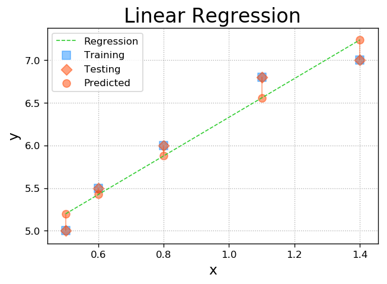
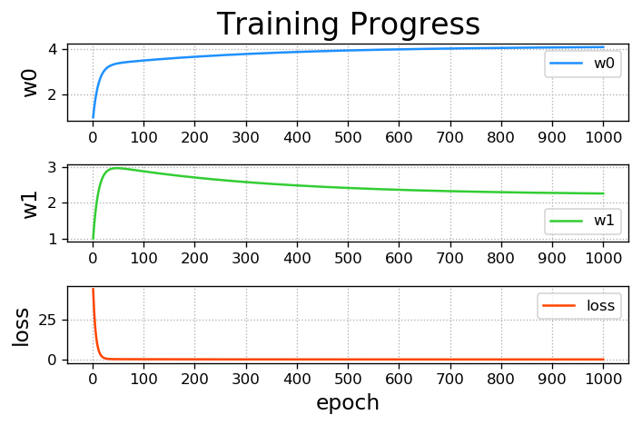
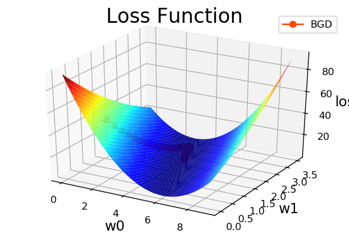
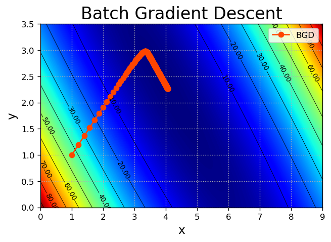
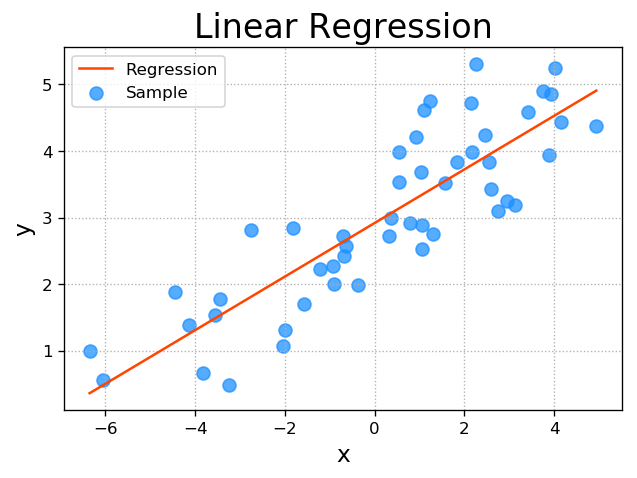
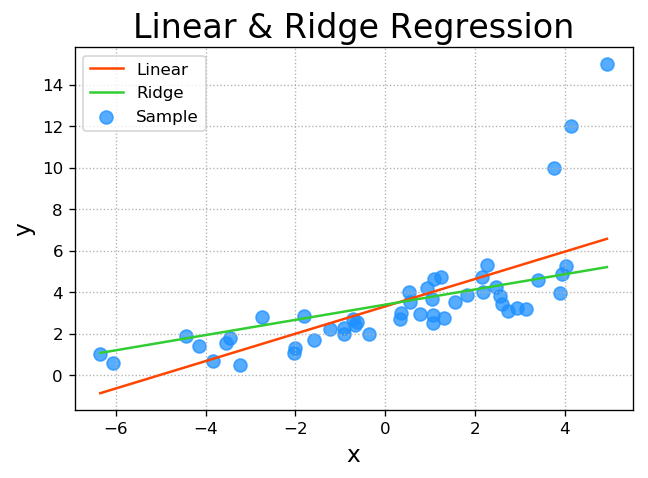
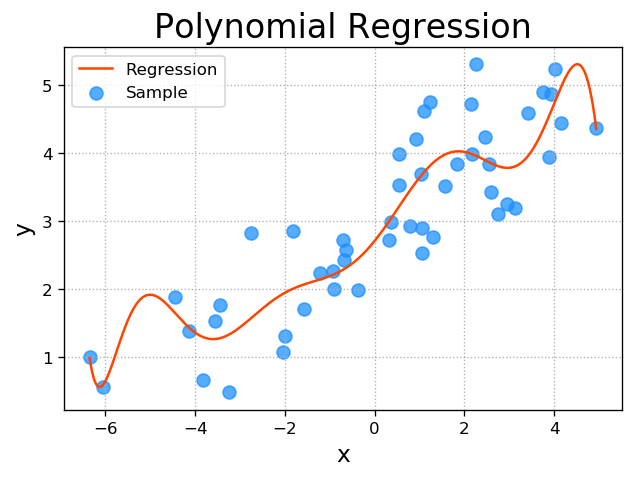

# 四、一元线性回归

### 1. 预测函数

输入 | 输出
- | -
0 | 1
1 | 3
2 | 5
3 | 7
4 | 9
...| ...


- 预测函数为：$y=1+2x$

- 预测：输入10；输出21

- $y=w_0+w_1x$，任务就是寻找预测函数中的模型参数$w_0$和$w_1$，以满足输入和输出之间的联系。

### 2. 单样本误差

- 随机 $x$ 代入 $y=w_0+w_1x$ 得到 $y'$ ，则单样本误差为：$$e=\frac{(y-y')^2}{2}$$

### 3. 总样本误差
- 总样本误差为：$$E=\sum {\frac{(y-y')^2}{2}}$$

### 4. 损失函数

- 损失函数为：$$Loss(w_0,w_1)=\sum {\frac{(y-(w_0+w_1x))^2}{2}}$$

- 任务就是寻找可以使损失函数取得最小值的模型参数 $w_0$ 和 $w_1$ 。

### 5. 梯度下降法寻优

1. 随机选择一组模型参数 $w_0$ 和 $w_1$ ，计算损失函数在该模型参数处的梯度 $[\partial{Loss}/\partial{w_0}, \partial{Loss}/\partial{w_1}]$

2. 计算与该梯度反方向的修正步长$[-n\partial{Loss}/\partial{w_0}, -n\partial{Loss}/\partial{w_1}]$

3. 计算下一组模型参数
$w_0=w_0-n\partial{Loss}/\partial{w_0}$
$w_1=w_1-n\partial{Loss}/\partial{w_1}$

4. 直到满足迭代终止条件：
    - 迭代足够多次；
    - 损失值已经足够小；
    - 损失值已经不再明显减少。
    
$Loss(w_0,w_1)=\sum {\frac{(y-(w_0+w_1x))^2}{2}}$

$\partial{Loss}/\partial{w_0}=\sum{\partial{\frac{(y-y')^2}{2}}/\partial{w_0}}=\sum{y-y'}$

$\partial{Loss}/\partial{w_1}=\sum{\partial{\frac{(y-y')^2}{2}}/\partial{w_1}}=\sum{(y-y')x}$


```python
# gd.py
import numpy as np
import matplotlib.pyplot as mp
from mpl_toolkits.mplot3d import axes3d

# 样本输入
train_x = np.array([0.5, 0.6, 0.8, 1.1, 1.4])
# 样本输出
train_y = np.array([5.0, 5.5, 6.0, 6.8, 7.0])
# 设置迭代次数
n_epoches = 1000
# 学习率设置为0.01，向量长度
lrate = 0.01
# 记录迭代次数和损失值
epoches, losses = [], []
# 设置初始值为1,1
w0, w1 = [1], [1]

# 开始迭代
for epoch in range(1, n_epoches + 1):
    epoches.append(epoch)  # 添加迭代次数
    # 计算本次损失值并添加，公式参考上述公式
    losses.append(((train_y - (w0[-1] + w1[-1] * train_x)) ** 2 / 2).sum())
    # 格式化打印当前数据
#     print('{:4}> w0={:.8f}, w1={:.8f}, loss={:.8f}'.format(epoches[-1], w0[-1], w1[-1], losses[-1]))
    # 关于dw0的损失值偏微分
    d0 = -(train_y - (w0[-1] + w1[-1] * train_x)).sum()
    # 关于dw1的损失值偏微分
    d1 = -((train_y - (w0[-1] + w1[-1] * train_x)) * train_x).sum()
    # 追加w0w1
    w0.append(w0[-1] - lrate * d0)
    w1.append(w1[-1] - lrate * d1)

# 删掉多算的一个
w0 = np.array(w0[:-1])
w1 = np.array(w1[:-1])

# 提取排序索引
sorted_indices = train_x.argsort()
# 提取顺序测试集
test_x = train_x[sorted_indices]
test_y = train_y[sorted_indices]
# 预测输出
pred_test_y = w0[-1] + w1[-1] * test_x

# 计算损失值
grid_w0, grid_w1 = np.meshgrid(np.linspace(0, 9, 500), np.linspace(0, 3.5, 500))
flat_w0, flat_w1 = grid_w0.ravel(), grid_w1.ravel()
# 计算扁平化损失值
flat_loss = (((flat_w0 + np.outer(train_x, flat_w1)) - train_y.reshape(-1, 1)) ** 2).sum(axis=0) / 2
# 网格化损失值
grid_loss = flat_loss.reshape(grid_w0.shape)

# ————————————————————————————————————————————————————————————
# 绘制线性回归图
mp.figure('Linear Regression', dpi=120)
mp.title('Linear Regression', fontsize=20)
mp.xlabel('x', fontsize=14)
mp.ylabel('y', fontsize=14)
mp.tick_params(labelsize=10)
mp.grid(linestyle=':')
# 训练数据点
mp.scatter(train_x, train_y, marker='s',
           c='dodgerblue', alpha=0.5, s=80,
           label='Training')
# 测试数据点
mp.scatter(test_x, test_y, marker='D',
           c='orangered', alpha=0.5, s=60,
           label='Testing')
# 预测数据点
mp.scatter(test_x, pred_test_y, c='orangered',
           alpha=0.5, s=60, label='Predicted')

# 获取误差值，并且连线
for x, y, pred_y in zip(
        test_x, test_y, pred_test_y):
    mp.plot([x, x], [y, pred_y], c='orangered',
            alpha=0.5, linewidth=1)
# 绘制回归线，即根据回归方程绘制的直线    
mp.plot(test_x, pred_test_y, '--', c='limegreen',
        label='Regression', linewidth=1)
mp.legend()


# ————————————————————————————————————————————————————————
mp.figure('Training Progress', dpi=120)
# 绘制过程图像w0
mp.subplot(311)
mp.title('Training Progress', fontsize=20)
mp.ylabel('w0', fontsize=14)
mp.gca().xaxis.set_major_locator(mp.MultipleLocator(100))
mp.tick_params(labelsize=10)
mp.grid(linestyle=':')

mp.plot(epoches, w0, c='dodgerblue', label='w0')
mp.legend()

# 绘制过程图像w1
mp.subplot(312)
mp.ylabel('w1', fontsize=14)
mp.gca().xaxis.set_major_locator(mp.MultipleLocator(100))
mp.tick_params(labelsize=10)
mp.grid(linestyle=':')

mp.plot(epoches, w1, c='limegreen', label='w1')
mp.legend()

# 绘制过程图像，迭代次数和损失值的关系
mp.subplot(313)
mp.xlabel('epoch', fontsize=14)
mp.ylabel('loss', fontsize=14)
mp.gca().xaxis.set_major_locator(mp.MultipleLocator(100))
mp.tick_params(labelsize=10)
mp.grid(linestyle=':')

mp.plot(epoches, losses, c='orangered', label='loss')
mp.legend()
mp.tight_layout()

# 绘制损失函数
mp.figure('Loss Function', dpi=120)
ax = mp.gca(projection='3d')
mp.title('Loss Function', fontsize=20)
ax.set_xlabel('w0', fontsize=14)
ax.set_ylabel('w1', fontsize=14)
ax.set_zlabel('loss', fontsize=14)
mp.tick_params(labelsize=10)

ax.plot_surface(grid_w0, grid_w1, grid_loss, rstride=10, cstride=10, cmap='jet')
ax.plot(w0, w1, losses, 'o-', c='orangered', label='BGD')
mp.legend()

# 扁平化
mp.figure('Batch Gradient Descent', dpi=120)
mp.title('Batch Gradient Descent', fontsize=20)
mp.xlabel('x', fontsize=14)
mp.ylabel('y', fontsize=14)
mp.tick_params(labelsize=10)
mp.grid(linestyle=':')

mp.contourf(grid_w0, grid_w1, grid_loss, 1000, cmap='jet')
cntr = mp.contour(grid_w0, grid_w1, grid_loss, 10,colors='black', linewidths=0.5)
mp.clabel(cntr, inline_spacing=0.1, fmt='%.2f', fontsize=8)
mp.plot(w0, w1, 'o-', c='orangered', label='BGD')


mp.legend()
mp.show()
```














### 6. 工具包

    import sklearn.linear_model as lm
    线性回归器 = lm.LinearRegression()
    线性回归器.fit(已知输入, 已知输出)     # 计算模型参数
    线性回归器.predict(新的输入)          ->新的输出
    
    import pickle  #  保存模型


```python
import numpy as np
import sklearn.linear_model as lm
import sklearn.metrics as sm
import matplotlib.pyplot as mp
import pickle

# 读取数据流程
x, y = [], []
with open('../data/single.txt', 'r') as f:
    for line in f.readlines():
        data = [float(substr) for substr in line.split(',')]
        x.append(data[:-1])
        y.append(data[-1])

# 转换为array
x = np.array(x)
y = np.array(y)

# 载入模型
# with open('../data/linear.pkl', 'rb') as f:
#     model = pickle.load(f)
    
# 建立线性模型
model = lm.LinearRegression()
# 计算模型参数
model.fit(x, y)
# 预测新的输出
pred_y = model.predict(x)
# 查看效果1/(1+E) 误差越大，越接近0；误差越小，接近1
print(sm.r2_score(y, pred_y))

# 保存模型
# with open('../../data/linear.pkl', 'wb') as f:
#     pickle.dump(model, f)
    
# 绘制回归图形
mp.figure('Linear Regression', dpi=120)
mp.title('Linear Regression', fontsize=20)
mp.xlabel('x', fontsize=14)
mp.ylabel('y', fontsize=14)
mp.tick_params(labelsize=10)
mp.grid(linestyle=':')
mp.scatter(x, y, c='dodgerblue', alpha=0.75, s=60, label='Sample')
# 将x变为一维数组，按照排序绘制点
sorted_indices = x.ravel().argsort()
mp.plot(x[sorted_indices], pred_y[sorted_indices], c='orangered', label='Regression')

mp.legend()
mp.show()
```

    0.7362638998481811





# 五、岭回归

- 通过正则的方法，即在损失函数中加入正则项，以减弱模型参数对熟练数据的匹配度，借以规避少数明显偏移正常范围的异常样本影响模型的回归效果。

$$Loss(w_0,w_1)=\sum{\frac{(y-(w_0+w_1x))^2}{2}}+正则强度 \times f(w_0,w_1)$$

- `lm.Ridge(300, fit_intercept=True)` (正则强度，是否约束)


```python
# rdg.py
import numpy as np
import sklearn.linear_model as lm
import matplotlib.pyplot as mp

x, y = [], []
with open('../data/abnormal.txt', 'r') as f:
    for line in f.readlines():
        data = [float(substr) for substr
                in line.split(',')]
        x.append(data[:-1])
        y.append(data[-1])
x = np.array(x)
y = np.array(y)

# 普通线性回归
model1 = lm.LinearRegression()
model1.fit(x, y)
pred_y1 = model1.predict(x)

# 岭回归，若正则强度为0，则为普通线性回归
model2 = lm.Ridge(300, fit_intercept=True)
model2.fit(x, y)
pred_y2 = model2.predict(x)

mp.figure('Linear & Ridge Regression', dpi=120)
mp.title('Linear & Ridge Regression', fontsize=20)
mp.xlabel('x', fontsize=14)
mp.ylabel('y', fontsize=14)
mp.tick_params(labelsize=10)
mp.grid(linestyle=':')

mp.scatter(x, y, c='dodgerblue', alpha=0.75, s=60, label='Sample')
sorted_indices = x.ravel().argsort()
mp.plot(x[sorted_indices], pred_y1[sorted_indices], c='orangered', label='Linear')
mp.plot(x[sorted_indices], pred_y2[sorted_indices], c='limegreen', label='Ridge')

mp.legend()
mp.show()
```





# 六、多项式回归

- 多元线性：$$y=w_0+w_1x_1+w_2x_2+w_3x_3+...+w_nx_n$$

- 将 $x^2, x^3 ... x^n$ 看作 $x_1, x_2, ...$ 

- 一元多项式：$$y=w_0+w_1x+w_2x^2+w_3x^3+...+w_nx^n$$

                                        x->多项式特征扩展器 -x1...xn-> 线性回归器->w0...wn
                                          \______________________________________/
                                                                   管线


```python
# poly.py
import numpy as np
import sklearn.pipeline as pl
import sklearn.preprocessing as sp
import sklearn.linear_model as lm
import sklearn.metrics as sm
import matplotlib.pyplot as mp

train_x, train_y = [], []
with open('../data/single.txt', 'r') as f:
    for line in f.readlines():
        data = [float(substr) for substr
                in line.split(',')]
        train_x.append(data[:-1])
        train_y.append(data[-1])
        
train_x = np.array(train_x)
train_y = np.array(train_y)
model = pl.make_pipeline(sp.PolynomialFeatures(10), lm.LinearRegression()) # 先sp预处理，参数为多项式最高次数，再使用lm方法
model.fit(train_x, train_y)
pred_train_y = model.predict(train_x)
print(sm.r2_score(train_y, pred_train_y))

test_x = np.linspace(train_x.min(), train_x.max(), 1000).reshape(-1, 1)
pred_test_y = model.predict(test_x)

mp.figure('Polynomial Regression', dpi=120)
mp.title('Polynomial Regression', fontsize=20)
mp.xlabel('x', fontsize=14)
mp.ylabel('y', fontsize=14)
mp.tick_params(labelsize=10)
mp.grid(linestyle=':')
mp.scatter(train_x, train_y, c='dodgerblue', alpha=0.75, s=60, label='Sample')
mp.plot(test_x, pred_test_y, c='orangered', label='Regression')

mp.legend()
mp.show()
```

    0.7868629092058498




