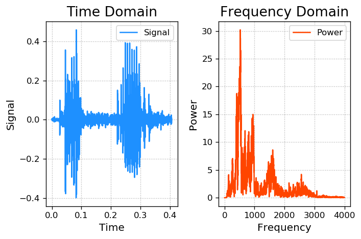
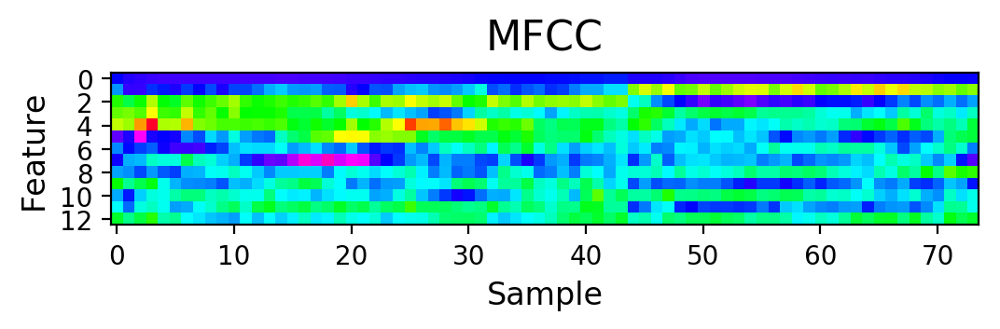

# 语音识别

### 1. 声音的本质是震动，震动的本质是位移关于时间的函数

Signal: s = f(t)

波形文件(.wav)中记录了不同采样时刻的位移

### 2. 通过傅里叶变换

可以将时间域的声音函数分解为一系列不同频率的正弦函数的叠加，通过频率谱线的特殊分布，建立音频内容和文本的对应关系，以此作为模型训练的基础。


```python
# audio.py
import numpy as np
import numpy.fft as nf  # 傅立叶变换
import scipy.io.wavfile as wf  # 读取wav文件
import matplotlib.pyplot as mp


sample_rate, sigs = wf.read('../data/freq.wav')
print("scamlpe rate:", sample_rate)
print("sigs shape:", sigs.shape, "type:", sigs.dtype)
```

    scamlpe rate: 8000
    sigs shape: (3251,) type: int16


```python
sigs = sigs / 2 ** 15  # 信息保留多
times = np.arange(len(sigs)) / sample_rate  # 形成采样时间

mp.figure('Audio', dpi=120)

mp.subplot(121)
mp.title('Time Domain', fontsize=16)
mp.xlabel('Time', fontsize=12)
mp.ylabel('Signal', fontsize=12)
mp.tick_params(labelsize=10)
mp.grid(linestyle=':')
mp.plot(times, sigs, c='dodgerblue', label='Signal')
mp.legend()

freqs = nf.fftfreq(sigs.size, 1 / sample_rate)  # 频率数组
ffts = nf.fft(sigs)  # 
pows = np.abs(ffts)  # 模

mp.subplot(122)
mp.title('Frequency Domain', fontsize=16)
mp.xlabel('Frequency', fontsize=12)
mp.ylabel('Power', fontsize=12)
mp.tick_params(labelsize=10)
mp.grid(linestyle=':')
mp.plot(freqs[freqs >= 0], pows[freqs >= 0], c='orangered', label='Power')
mp.legend()
mp.tight_layout()
mp.show()
```





### 3. 梅尔频率倒谱系数(MFCC)

通过与声音内容密切相关的13个特殊频率所对应的能量分布，作为语音的特征。


```python
# mfcc.py
import numpy as np
import numpy.fft as nf
import scipy.io.wavfile as wf
import python_speech_features as sf  # python的语音特征抽取
import matplotlib.pyplot as mp


sample_rate, sigs = wf.read('../data/speeches/training/orange/orange01.wav')
mfcc = sf.mfcc(sigs, sample_rate)
print("mfcc's shape:", mfcc.shape)
```

    mfcc's shape: (74, 13)


```python
mp.figure('MFCC', dpi=200)
mp.matshow(mfcc.T, cmap='gist_rainbow', fignum='MFCC')
mp.title('MFCC', fontsize=16)
mp.xlabel('Sample', fontsize=12)
mp.ylabel('Feature', fontsize=12)
mp.tick_params(which='both', top=False, labeltop=False, labelbottom=True, labelsize=10)
mp.show()
```





### 4. 语音识别


```python
# |____training
# | |____apple
# | | |____apple07.wav
# | |____lime
# | | |____lime07.wav
# | | |____lime13.wav
# |____testing
# | |____apple
# | | |____apple15.wav
# | |____kiwi
# | | |____kiwi15.wav
# | |____lime
# | | |____lime15.wav....
# spch.py
import os  # 要从目录中检索
import warnings
import numpy as np
import scipy.io.wavfile as wf
import python_speech_features as sf
import hmmlearn.hmm as hl  # 


warnings.filterwarnings('ignore', category=DeprecationWarning)
np.seterr(all='ignore')

def search_speeches(directory, speeches):
    directory = os.path.normpath(directory)  # 将路径格式转换为本机格式
    if not os.path.isdir(directory):
        raise IOError("The directory" + directory + "doesn't exist")
    for entry in os.listdir(directory):
        label = directory[directory.rfind(os.path.sep) + 1:]  # 本机分隔符
        path = os.path.join(directory, entry)
        if os.path.isdir(path):  # 如果path是目录
            search_speeches(path, speeches)
        elif os.path.isfile(path) and path.endswith('wav'):  # 判断是否为文件
            if label not in speeches:
                speeches[label] = []
            speeches[label].append(path)
```


```python
# 训练数据的输入输出
train_speeches = {}  # 
search_speeches('../data/speeches/training', train_speeches)
train_x, train_y = [], []
for label, filenames in train_speeches.items():
    mfccs = np.array([])
    for filename in filenames:
        saple_rate, sigs = wf.read(filename)
        mfcc = sf.mfcc(sigs, sample_rate)
        if len(mfccs) == 0:
            mfccs = mfcc
        else:
            mfccs = np.append(mfccs, mfcc, axis=0)
    train_x.append(mfccs)
    train_y.append(label)
print(len(train_x), len(train_y))
```

    7 7


```python
# 训练模型
models = {}
for mfccs, label in zip(train_x, train_y):
    # 高斯 hidden 马尔可夫 模型 （基于高斯分布的隐马尔可夫模型）
    model = hl.GaussianHMM(n_components=4, covariance_type='diag', n_iter=1000)
    models[label] = model.fit(mfccs)
```


```python
# 测试数据的测试
test_speeches = {}  # 
search_speeches('../data/speeches/testing', test_speeches)
test_x, test_y = [], []
for label, filenames in test_speeches.items():
    mfccs = np.array([])
    for filename in filenames:
        saple_rate, sigs = wf.read(filename)
        mfcc = sf.mfcc(sigs, sample_rate)
        if len(mfccs) == 0:
            mfccs = mfcc
        else:
            mfccs = np.append(mfccs, mfcc, axis=0)
    test_x.append(mfccs)
    test_y.append(label)
    
pred_test_y = []
for mfccs in test_x:
    best_score, best_label = None, None
    for label, model in models.items():
        score = model.score(mfccs)  # 相似度得分
        if (best_score is None) or (best_score < score):
            best_score, best_label = score, label
    pred_test_y.append(best_label)
    
print(test_y)
print(pred_test_y)
```

    ['apple', 'kiwi', 'lime', 'banana', 'pineapple', 'orange', 'peach']
    ['apple', 'kiwi', 'lime', 'banana', 'pineapple', 'orange', 'peach']


### 5. 声音合成


```python
import json
import numpy as np
import scipy.io.wavfile as wf


with open('../data/12.json', 'r') as f:
    freqs = json.loads(f.read())
print(freqs)
```

    {'C0': 16.35, 'C#0': 17.32, 'D0': 18.35, 'D#0': 19.45, 'E0': 20.6, 'F0': 21.83, 'F#0': 23.12, 'G0': 24.5, 'G#0': 25.96, 'A0': 27.5, 'A#0': 29.14, 'B0': 30.87, 'C1': 32.7, 'C#1': 34.65, 'D1': 36.71, 'D#1': 38.89, 'E1': 41.2, 'F1': 43.65, 'F#1': 46.25, 'G1': 49.0, 'G#1': 51.91, 'A1': 55.0, 'A#1': 58.27, 'B1': 61.74, 'C2': 65.41, 'C#2': 69.3, 'D2': 73.42, 'D#2': 77.78, 'E2': 82.41, 'F2': 87.31, 'F#2': 92.5, 'G2': 98.0, 'G#2': 103.83, 'A2': 110.0, 'A#2': 116.54, 'B2': 123.47, 'C3': 130.81, 'C#3': 138.59, 'D3': 146.83, 'D#3': 155.56, 'E3': 164.81, 'F3': 174.61, 'F#3': 185.0, 'G3': 196.0, 'G#3': 207.65, 'A3': 220.0, 'A#3': 233.08, 'B3': 246.94, 'C4': 261.63, 'C#4': 277.18, 'D4': 293.66, 'D#4': 311.13, 'E4': 329.63, 'F4': 349.23, 'F#4': 369.99, 'G4': 392.0, 'G#4': 415.3, 'A4': 440.0, 'A#4': 466.16, 'B4': 493.88, 'C5': 523.25, 'C#5': 554.37, 'D5': 587.33, 'D#5': 622.25, 'E5': 659.25, 'F5': 698.46, 'F#5': 739.99, 'G5': 783.99, 'G#5': 830.61, 'A5': 880.0, 'A#5': 932.33, 'B5': 987.77, 'C6': 1046.5, 'C#6': 1108.73, 'D6': 1174.66, 'D#6': 1244.51, 'E6': 1318.51, 'F6': 1396.91, 'F#6': 1479.98, 'G6': 1567.98, 'G#6': 1661.22, 'A6': 1760.0, 'A#6': 1864.66, 'B6': 1975.53, 'C7': 2093.0, 'C#7': 2217.46, 'D7': 2349.32, 'D#7': 2489.02, 'E7': 2637.02, 'F7': 2793.83, 'F#7': 2959.96, 'G7': 3135.96, 'G#7': 3322.44, 'A7': 3520.0, 'A#7': 3729.31, 'B7': 3951.07, 'C8': 4186.01, 'C#8': 4434.92, 'D8': 4698.63, 'D#8': 4978.03, 'E8': 5274.04, 'F8': 5587.65, 'F#8': 5919.91, 'G8': 6271.93, 'G#8': 6644.88, 'A8': 7040.0, 'A#8': 7458.62, 'B8': 7902.13}


```python
tones = [
    ('G5', 1.5),
    ('A5', 0.5),
    ('G5', 1.5),
    ('E5', 0.5),
    ('D5', 0.5),
    ('E5', 0.5),
    ('D5', 0.5),
    ('C5', 0.5),
    ('A4', 0.5),
    ('C5', 0.75)]

sample_rate = 44100
music = np.empty(shape=1)
for tone, duration in tones:
    times = np.linspace(0, duration, duration * sample_rate)
    sound = np.sin(2 * np.pi * freqs[tone] * times)
    music = np.append(music, sound)
music *= 2 ** 15
music = music.astype(np.int16)

wf.write('../data/music1.wav', sample_rate, music)
```
