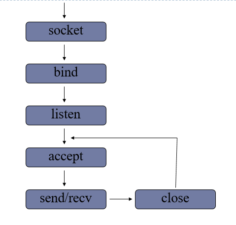
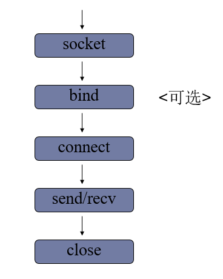

# PythonNET 网络编程
---

- ISO（国际标准化组织）

- 制定了

- **OSI（Open System Interconnectio）**，意为开放式系统互联。国际标准化组织（ISO）制定了OSI模型，该模型定义了不同计算机互联的标准，是设计和描述计算机网络通信的基本框架。
   - 网络通信工作流程的标准化
   
Ps.
- 高内聚：模块功能尽可能单一，不要掺杂
- 低耦合：模块之间尽可能减少关联和影响

# 模型

## OSI 七层模型

- 应用层
    - 提供用户服务，具体功能由特定程序而定
- 表示称
    - 提供数据压缩、优化、加密
- 会话层
    - 建立应用级的连接，选择传输服务
- 传输层
    - 提供不同的传输服务。流量控制
- 网络层
    - 路由选择，网络互联
- 链路层
    - 进行数据转换，具体消息的发送，链路连接
- 物理层
    - 物理硬件、接口设定、网卡路由交换机等


- 优点：
    1. 将工作流程标准化
    2. 降低了模块之间的耦合度，使每一部分可以单独开发、工作


## 四层模型

- 应用层
- 传输层
- 网络层
- 物理链路层

## 五层模型 TCP/IP模型
- 应用层（包括应用层、表示层、会话层）
- 传输层
- 网络层
- 链路层
- 物理层

# 数据的传输流程

1. 发送端由**应用层**到**物理层**逐层添加信息头（首部），最终在物理层发送。
2. 中间经过节点（交换机，路由器等）转发，发送到**接受端**。
3. 在接收端根据发送端的每个信息头进行解析，最终消息到应用层展示给用户。


- 网络协议：在网络通信中双方都遵循的规定。包括建立什么样的网络结构、消息结构、标示代表什么等。

- 例如：
- 应用层：TFTP HTTP DNS SMTP
- 传输层：TCP UDP
- 网络层：IP
- 物理层：IEEE

# 网络相关概念
- 网络主机：在网络中标示一台计算机 HOST
- 本地使用：'localhost' '127.0.0.1'
- 网络使用：'0.0.0.0.' '172.xxx.xxx.xxx' 
- `ifconfig/ipconfig`：查看IP


- 获取计算机名
        In [2]: socket.gethostname()                                                    
        Out[2]: 'EnweiHaos-MacBook-Pro.local'

        In [3]: socket.gethostbyname('EnweiHaos-MacBook-Pro.local')                     
        Out[3]: '192.168.2.104''
        
        
- IP地址：网络上确定一台主机网络位置的地址
- IPv4：点分十进制；192.168.1.2；0～255；32位；有2的32次方种可能
- IPv6：128位


- `ping ip`：测试和某台网络主机是否联通


- 特殊IP地址
    - 127.0.0.1 本地测试IP
    - 0.0.0.0 使用本机可用IP
    - 192.168.1.0 表示网段IP
    - 192.168.1.1 网关IP
    - 192.168.1.255 广播地址
    
    
- 通过地址获取主机网络信息
        In [7]: socket.gethostbyaddr('www.baidu.com')
        Out[7]: ('127.0.0.1', [], ['119.75.216.20'])
                  主机名     别名   网络地址

- 点分十进制地址转换为二进制
        In [9]: socket.inet_aton('192.168.1.2')
        Out[9]: b'\xc0\xa8\x01\x02'

- 二进制地址转换为点分十进制
        In [10]: socket.inet_ntoa(b'\xc0\xa8\x01\x02')
        Out[10]: '192.168.1.2'

- 域名 ： 网络服务器地址的名称
    1. 方便记忆
    2. 名称表达一定的含义


- **网络端口号**
    - 端口是网络地址的一部分，用于区分一个网络主机上的网络应用
    * 在一个操作系统中不同的网络应用监听不同的端口号
    
    
        - 取值范围：1～65535
            - 1～255：一些众所周知的通用端口
            - 256～1023：系统应用端口
            - 65535：自用端口
            - 建议使用 >10000
            
            
        - 获取一个应用的端口信息
                In [11]: socket.getservbyname('mysql')
                Out[11]: 3306


- 网络字节序： 数据在网络中的传输格式


# 传输层服务

## 面向连接的传输服务：基于TCP（Transmission Control Protocol ）协议的数据传输
- 传输特征 ：提供可靠的数据传输，**可靠性**指数据传输过程中**无丢失，无失序，无差错，无重复**。
- 实现手段：数据**传输断开**前都需要进行传输和断开的**确认**
- 应用情况：适用于传输较大的文件，网络情况良好，需要保证传输可靠性的情况。  
- 比如： 网页的获取，文件下载，邮件传输，登录注册

### 三次握手：TCP传输在数据传输前建立连接的过程
1. 客户端向服务器发送连接请求 
2. 服务器收到请求后，回复确认消息，表示允许连接
3. 客户端收到服务器回复，进行最终标志发送确认连接


### 四次挥手：TCP传输在连接断开前进行断开确认的过程
1. 主动发发送报文告知被动方要断开连接
2. 被动方收到请求后立即返回报文告知已经准备断开
3. 被动方准备就绪后再次发送报文告知可以断开
4. 主动方发送消息，确认最终断开


## 面向无连接的传输服务：基于UDP（User Datagram Protoco）协议的传输
- 传输特点 ： 不保证传输的可靠性，传输过程没有连接和断开的流程，数据收发自由。
- 使用情况 ： 网络情况较差，对传输可靠性要求不高，需要提升传输效率。不便连接，需要灵活收发消息。
- 比如：网络视频，群聊，广播发送

# 要求
>1. osi七层模型介绍一下，tcp/ip模型呢?
>2. tcp服务和udp服务有什么区别?
>3. 三次握手和四次挥手是什么意思，过程是怎样的?

# socket 套接字编程
- 目标：根据**socket模块**提供的接口函数，进行组合使用完成基于TCP或者UDP的网路编程
- 套接字：完成上述目标的一种编程手段，编程方案

## 套接字分类：
- 流式套接字（SOCK_STREAM）：传输层基于**TCP**协议的套接字编程方案。
- 数据报套接字（SOCK_DGRAM）：传输层基**UDP**协议的套接字编程方案。
- 底层套接字（SOCK_RAM）：访问底层协议的套接字编程。

 **面向连接的传输--TGP协议--可靠地--流式套接字**  
 **面向无连接传输--UDP协议--不可靠--数据报套接字**

## TCP套接字（流式套接字）*服务端编程*



`import  socket`  
### 1、创建套接字

        sockfd = socket.socket(socket_family = AF_INET,
                               socket_type = SOCK_STREAM,
                               proto = 0)
- **功能**：创建套接字
- **参数**：
    - socket_family:选择地址族类型  
        - AF_INET -> IPv4
        - AF_INET6 -> IPv6
    - socket_type:套接字类型 
        - SOCK_STREAM 流式
        - SOCK_DGRAM 数据报
    - proto:选择子协议类型，通常为0
- **返回值**：返回套接字对象
    
    
 
### 2、绑定服务端地址

        sockfd.bind(addr)

- **功能**：绑定IP地址
- **参数**：元组（ip，port）

    - localhost    可以被本机用
    - 127.0.0.1    同上
    - 192.168.205.127   可以被所有人用192.168.205.127访问
    - 0.0.0.0  可以被所有人用192.168.205.127访问；也可被自己用127.0.0.1访问


### 3、设置监听套接字
        sockfd.listen(n)
- **功能**：将套接字设置为监听套接字，创建监听队列
- **参数**：n 表示监听队列大小  
**一个监听套接字可以连接多个客户端套接字**

### 4、等待处理客户端连接请求
        connfd, addr = sockfd.accept()
- **功能**：阻塞等待处理客户端连接
- **返回值**：
    - connfd  客户端连接套接字
    - addr    连接的客户端地址  
**阻塞函数：程序运行过程中遇到阻塞函数则暂停运行，直到某种阻塞条件达成再继续运行**

### 5、消息收发
        data = connfd.recv(buffersize)
- **功能**：接收对应客户端消息
- **参数**：一次最多接收多少字节
- **返回值**：接收到的内容  
**如果没有消息则会阻塞**

        n = connfd.send(data)
- **功能**：发送消息给对应客户端
- **参数**：要发送的内容，必须是bytes格式
- **返回值**：返回实际发送消息的大小

### 6、关闭套接字
        sockfd.close()
- **功能**：关闭套接字


```python
# tcp_server.py
from socket import * 

# 创建套接字
sockfd = socket(AF_INET,SOCK_STREAM)

# 绑定地址
sockfd.bind(('0.0.0.0',9900))

# 设置监听
sockfd.listen(5)

# 等待接受连接
print("Waiting for connect...")
connfd,addr = sockfd.accept()
print("Connect from",addr)

while True:
    # 收发消息
    data = connfd.recv(1024).decode()
    if data == "##":
        break
    print(data)
    n = connfd.send(b'Receive your message')
    print("发送了%d字节" % n)

# 关闭套接字
connfd.close()
sockfd.close()

# telnet macOS下载：https://blog.csdn.net/licheng70356213/article/details/81162660 
# $ telnet 127.0.0.1 9996
# Trying 127.0.0.1...
# Connected to localhost.
# Escape character is '^]'.
# hello 
# Receive your messageConnection closed by foreign host.
```

## TCP套接字（流式套接字）*客户端编程*



- 创建套接字  
   **必须相同类型的套接字才能通信**
   
- 建立连接
       sockfd.connect(servr_addr)
    - **功能**：建立连接
    - **参数**：元组，服务端地址
- 消息收发  
   **消息收发要和服务端配合，避免两边都出现recv阻塞**
- 关闭套接字


```python
# tcp_client.py
from socket import *

# 创建套接字
sockfd = socket(AF_INET,SOCK_STREAM)

# 发起连接
server_addr = ('192.168.207.129',9900)
sockfd.connect(server_addr)

while True:
    # 消息发送接收
    data = input("发送>>")
    sockfd.send(data.encode())
    if data == '##':
        break
    data = sockfd.recv(1024)
    print("接受到:",data.decode())

# 关闭套接字
sockfd.close()
```

## 套接字传输注意事项
1. 监听套接字存在客户端即可发起连接，但是最终连接的处理需要**accept**进行处理
2. 如果连接的另外一段退出，则**recv**会立即返回空子串不再阻塞。
3. 当连接的另一端退出时，再试图**send**发送就会产生**BrokenPipeError**

### 网络收发缓冲区
- 缓冲区作用：
    - 协调收发（处理）速度
    - 减少交互次数

send和recv实际上是和缓冲区进行交互，发送缓冲区满时就无法发送，接收缓冲区满时recv才阻塞

```
例如：connfd.recv(5)
```
若超过五个则会重复运行，直到发送完成

### TCP粘包（消息粘连，不区分边界）
- 产生原因：
    - tcp套接字以字节流方式传输，没有消息边界
    - 发送和接收并不能保证每次发送都及时的被接收

- 影响：
    - 如果每次发送内容表达一个独立的含义此时可能需要处理粘包防止产生歧义  


- 处理方法：
    1. 每次发送的消息添加结尾标志 （人为增加消息边界）
    2. 发送数据结构体
    3. 协调收发速度，每次发送后都预留接收时间

## UDP套接字（数据报套接字）*服务端编程*


### 1、创建数据报套接字
    sockfd = socket(AF_INET,SOCK_DGRAM)

### 2、绑定地址
    sockfd.bind(addr)

### 3、消息的收发
    data,addr = sockfd.recvfrom(buffersize)
    
- **功能**：接收UDP消息
- **参数**：每次最多接收多大的消息
- **返回值**：
    - data接收到的数据
    - addr消息发送端的地址

**一次接收一个数据报，如果数据报大小大于buffersize则会丢失部分消息**

    sockfd.sendto(data,addr)
- **功能**：发送udp消息
- **参数**：
    - data发送的消息
    - addr目标地址
- **返回值**：发送的字节数

### 4、关闭套接字
    sockfd.close()


```python
from socket import *

#创建数据报套接字
sockfd = socket(AF_INET,SOCK_DGRAM)

#绑定服务端地址
server_addr = ('0.0.0.0',9999)
sockfd.bind(server_addr)

#消息收发
while True:
    data,addr = sockfd.recvfrom(5)
    print("Receive from %s:%s"%\
        (addr,data.decode()))
    sockfd.sendto('收到你的消息'.encode(),addr)

sockfd.close()
```

## UDP套接字（数据报套接字）*客户端编程*

1. 创建套接字 
       socket(AF_INET,SOCK_DGRAM)
2. 消息收发
       recvfrom/sendto
3. 关闭套接字
       close（）

## sys补充
1. sys.argv 属性
    - 功能 ： 获取命令行参数，得到一个列表
    - 命令本身是 argv[0]
    - 后面的参数从argv[1]开始，默认以空格分隔
    - 使用引号引起来的内容算作一个整体
    - 命令行参数都以字符串放入列表  
    例如：
    ``` 
     $ python udp_clinet.py 123 321
     > sys.argv = ['udp_clinet.py','123', '321']```


2. 直接执行程序
在程序的第一行加
#!/usr/bin/env python3
添加程序的执行权限
chmod  755  file.py
修改后即可通过 ./file.py  运行程序


```python
from socket import * 
import sys 

if len(sys.argv) < 3:
    print('''
        argv is error!
        run as 
        python3 udp_client.py 127.0.0.1 9999
        ''')
    raise 

#从命令行输入IP,端口
HOST = sys.argv[1]
PORT = int(sys.argv[2])
ADDR = (HOST,PORT)

#创建套接字
sockfd = socket(AF_INET,SOCK_DGRAM)

#消息收发
while True:
    data = input("消息:")
    if not data:
        break
    sockfd.sendto(data.encode(),ADDR)
    data,addr = sockfd.recvfrom(1024)
    print("从服务器收到:",data.decode())
sockfd.close()
```

## TCP套接字编程和UDP套接字编程区别
1. 流式套接字使用**字节流**的方式传输，数据报套接字以**数据报**形式传输数据
2. tcp会有**粘包**现象，udp有消息边界不会形成粘包
3. tcp可以保障数据传输**完整性**，udp则不保证
4. tcp需要进行**listen accept**操作，udp不需要
5. tcp收发消息使用新的套接字，**recv send**；udp使用**recvfrom sendto**

## 补充函数
    sendall(data)
- 功能 ： 发送tcp消息
- 参数 ： 要发送的内容，bytes格式
- 返回值 ： 成功返回 None 失败产生异常

# 套接字对象 

- s.family:获取套接字地址族类型
- s.type:获取套接字类型
- s.getsockname():获取套接字的绑定地址
- s.fileno():获取套接字的文件描述符
    - 文件描述符：每一个IO事件操作系统都会分配一个不同的正整数作为编号，改正整数即为这个IO的文件描述符。

**文件描述符是操作系统识别IO的唯一标志**

        stdin ---> 0
        stdout --> 1
        stderr --> 2

- s.getpeername():获取客户端连接套接字的对应地址

- s.setsockopt(level,option,value)
    - 功能：设置套接字选项，丰富或者修改套接字属性功能
    - 参数： 
        - level 选项类别   SOL_SOCKET
        - option 具体选项
        - value  选项值


- s.getsockopt(level,option)
    - 功能：获取套接字选项值
    - 参数： 
        - level 选项类别   SOL_SOCKET
        - option 具体选项
    - 返回值：选项值

**如果要设置套接字选项，最好在创建套接字之后立即设置**


```python
from socket import * 

s = socket()

#设置端口立即释放
s.setsockopt(SOL_SOCKET,SO_REUSEADDR,1)

#获取套接字选项值
print(s.getsockopt(SOL_SOCKET,SO_REUSEADDR))

#获取套接字地址族类型
print(s.family)

#获取套接字类型
print(s.type)

s.bind(('127.0.0.1',9998))
#获取绑定地址
print(s.getsockname())

#获取套接字文件描述符
print(s.fileno())

s.listen(5)

while True:
    c,addr = s.accept()
    print("Connect from",c.getpeername())
    c.recv(1024)
```
